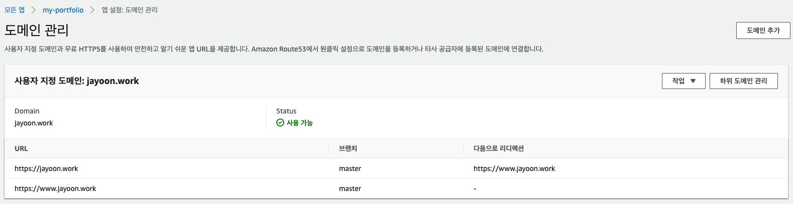
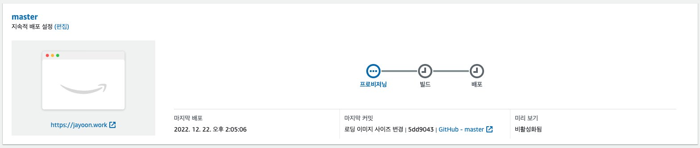

개발자라면 누구나 포트폴리오 하나쯤은 있어야죠! ~~아직 이직 생각은 없지만~~ 저도 포트폴리오를 한 번 만들어 볼까 하고 검색을 하다가 aws amplify라는 것을 알게 되었습니다.

aws amplify는 간단히 말하자면 나의 리액트 프로젝트를 서버 없이 아주 간편하게 웹에 배포할 수 있게 해 주는 솔루션입니다. 프로젝트를 내 저장소(github)에 올리고 커밋과 푸시를 하면 자동으로 내가 연결한 호스팅 서버로 배포를 해주는 시스템이죠. 심지어 구매한 도메인과 연결하는 것도 아주 편하게 할 수 있습니다.

AWS Amplify 콘솔에 대한 설명은 다음과 같습니다.

[AWS Amplify 콘솔](https://aws.amazon.com/ko/amplify/)은 단일 페이지 웹 애플리케이션이나 서버리스 백엔드가 포함된 정적 사이트를 개발, 배포 및 호스팅하기 위한 Git 기반의 CI/CD 워크플로를 제공합니다. Amplify는 Git 리포지토리에 연결 시 프런트엔드 프레임워크와 [Amplify CLI](https://aws-amplify.github.io/docs/cli/concept)를 사용하여 구성된 모든 서버리스 백엔드 리소스의 빌드 설정을 결정하고 코드가 커밋될 때마다 업데이트를 자동으로 배포합니다.

긴 말 필요없이 자습서 링크를 공유하도록 하겠습니다.

[AWS 자습서 링크](https://aws.amazon.com/ko/getting-started/hands-on/deploy-react-app-cicd-amplify/)

자체 CDN과 s3를 이용하여 빠르고 편리하게 웹 페이지를 랜딩할 수 있습니다. 저는 우선 제가 구매한 도메인과 로컬 리액트 소스를 간편하게 연동할 수 있다는 점 (무려 SSL도 지원해 줍니다), 그리고 별도의 배포 과정 없이 github에 push하는 것만으로도 소스 상태를 최신으로 유지할 수 있다는 점이 끌려서 해당 솔루션을 사용하게 되었습니다.

쇼핑을 좋아하는 저는 먼저 도메인부터 구매를 하였습니다. (godaddy 사용)

이렇게 검색을 하면 사용 가능한 도메인 목록이 나열됩니다. 저는 1년에 만원이 채 되지 않는 저렴이(jayoon.work)로 골라 보았습니다.

카트에 도메인을 담고 결제를 하면 바로 내 도메인을 쓸 수 있게 됩니다.

그럼 이제부터 amplify console을 이용하여 리액트 프로젝트를 어떻게 내 도메인으로 연결하는지 알아보도록 하겠습니다.

먼저 로컬에서 리액트 프로젝트를 열심히 만듭니다. (저는 이번에는 create-react-app 대신 쉽고 빠른 vite을 사용해서 만들었습니다.) 그리고 제 개인 저장소 github에 연결을 하였습니다. 본 포스트에서는 호스팅이 목적이기 때문에 리액트 프로젝트 및 github 사용법에 대해서는 다루지 않겠습니다.

먼저 aws amplify console에 접속해서 회원가입 후 로그인을 하면, [모든 앱]이라는 화면이 보입니다. 여기서 우측 상단의 [새 앱] > [웹 앱 호스팅]을 클릭합니다.

저는 github을 선택하고 계속을 클릭하였습니다. 그러면 이렇게 github 계정으로 로그인하라는 메시지가 나옵니다.

로그인을 완료하면 리포지토리 브랜치를 추가하라는 창이 뜹니다. 여기서 내 저장소에서 사용하고 싶은 프로젝트를 선택합니다.

다음으로 넘어가면 빌드 설정을 할 수 있습니다. 저는 기본값을 그대로 사용하였습니다.

마지막으로 저장 및 배포를 클릭하면 끝이 납니다! 정말 쉽죠?

이렇게 배포를 완료하면 이제 콘솔에 내 앱이 표시됩니다.

도메인을 사지 않더라도 이렇게 aws에서 제공해주는 주소로 내 앱이 연결된 모습을 확인할 수 있습니다. 이렇게 하고 나서 IDE에서 commit 및 push를 하면 자동으로 배포가 되고, 우측의 상태 바에 배포 완료 표시가 나타납니다.

다음은 앱 설정 값에 대해 알아보겠습니다. 저는 이미 도메인을 연결한 상태이기 때문에 프로덕션 브랜치 URL에 제가 구매한 도메인 주소가 나타나고 있습니다.

다음은 도메인 연결을 해보도록 하겠습니다. 왼쪽의 [도메인 관리] 탭을 선택합니다.

우측의 [도메인 추가]를 클릭하여 내 도메인 주소를 입력하면, DNS 레코드를 업데이트하는 창이 나옵니다. godaddy에서 제공하는 DNS의 권한을 aws amplify로 가져오겠다는 의미입니다.

godaddy 페이지로 들어가서 내 도메인의 cname 정보를 가져와 입력합니다. (편집하는 과정은 스샷으로 남겨두지 않아 완료된 화면을 보여드립니다.)

무료로 ssl 사용을 하기 위해 [하위 도메인 관리]로 들어가서 https 설정을 합니다.

모든 작업이 완료되고 콘솔 메인으로 돌아온 후 실제로 배포를 해보겠습니다.

IDE에서 소스를 수정하고 commit 및 push를 수행하면 바로 상태 값이 변경됩니다.

이렇게 순차적으로 과정을 지켜볼 수 있습니다. 모든 배포가 완료되고 나면 실제 서버로 들어가서 소스가 최신으로 반영되었는지 확인할 수 있습니다.

(+) 이슈 사항

> 1. jpeg 확장자의 이미지를 부르지 못하는 이슈가 있어서 설정값에 추가를 해 주었습니다.
> 2. SSL 적용된 주소로 리다이렉트되지 않는 이슈가 있어서, [jayoon.work](http://jayoon.work) 또는 [http://jayoon.work](http://jayoon.work) 를 입력하면 자동으로 [https://www.jayoon.work](https://www.jayoon.work) 로 이동하도록 설정하였습니다.

연결하는 모든 과정을 처음부터 기록으로 남겼으면 더 정확하고 좋았을 텐데 이미 설정이 완료된 상태로 포스팅을 하려니 한계가 있네요. 그렇지만 지금까지 남긴 내용만으로도 충분히 호스팅 연결이 가능할 것이라고 생각됩니다.
