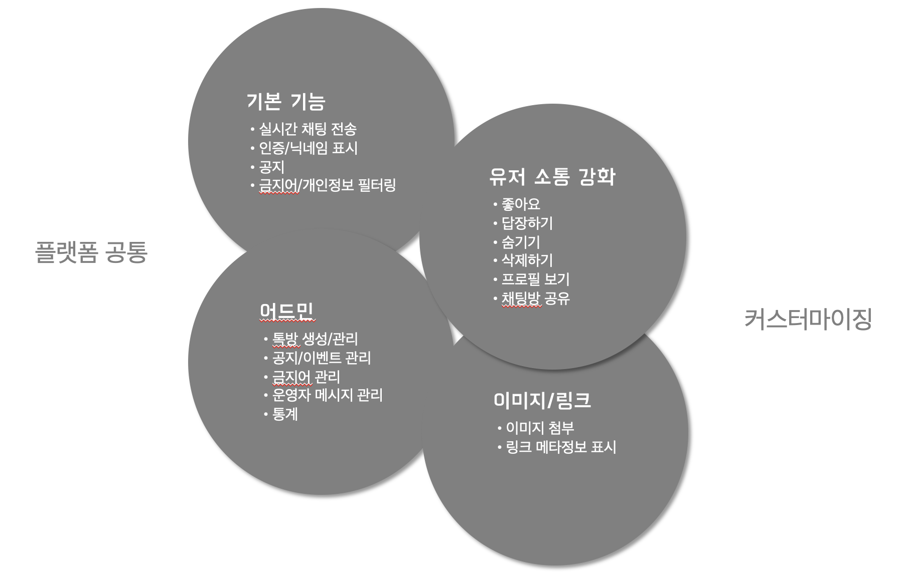
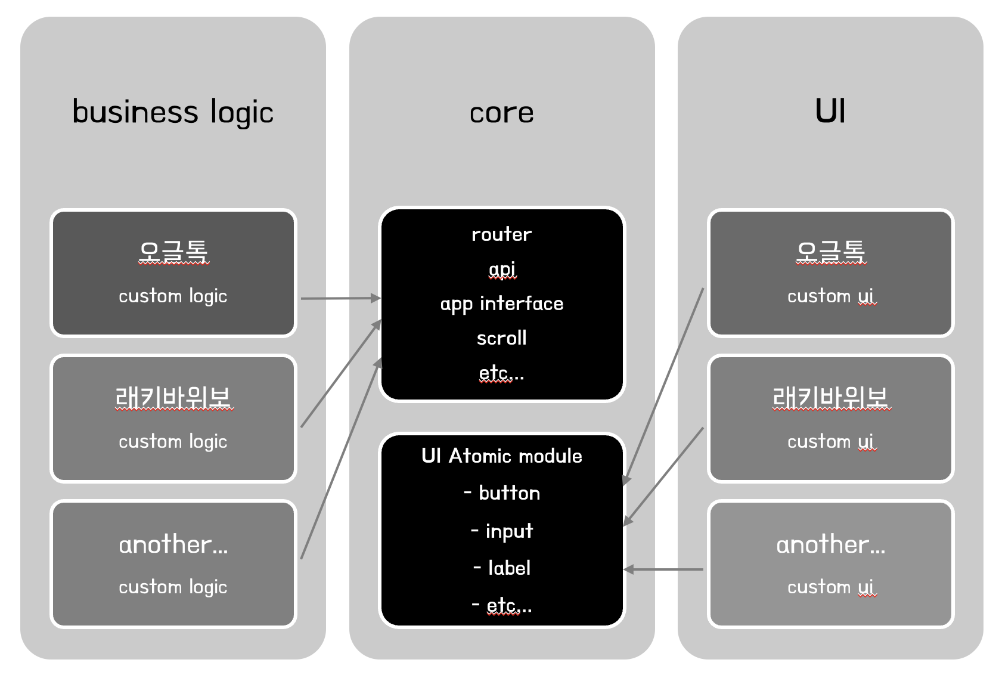
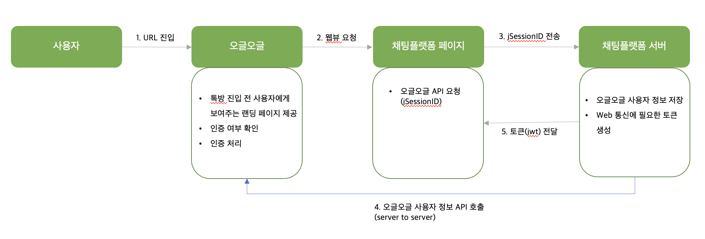

올해 초, 오랜만에 새로운 프로젝트를 시작했습니다. 바로 채팅플랫폼을 만드는 프로젝트였는데요, 말 그대로 채팅이 가능한 하나의 Platform을 만들어서 그걸 여러 서비스에 적용하는 프로젝트입니다.

시작하는 시점에 이미 두 개의 서비스가 정해졌는데, 하나는 네이버톡과 같이 특정 주제로 다양한 대화를 나눌 수 있는 오픈톡방이었고, 다른 하나는 가위바위보 게임장 내 간단히 유저들끼리 메시지만 주고받을 수 있는 형태의 채팅방이었습니다.

서비스 성격과 접속 환경 등을 고려하여 아키텍처를 설계해야 했는데, 주요 요구사항은 다음과 같았습니다.

1. 실시간 양방향 통신 기능
2. 모바일 웹, PC 웹, Android 및 iOS 앱 내 웹뷰 지원
3. 기존 서비스의 세션을 가져오는 인증 절차

우선 실시간 양방향 통신 기능을 지원하기 위해 여러 가지 리서치를 했는데요, 사내 다른 서비스에서 기존에 사용하고 있던 채팅 기능이 있어 먼저 그 서비스의 방식을 살펴보았습니다.

해당 서비스에서는 폴링 방식을 사용하고 있었는데, 폴링은 일정 시간 동안의 요청을 모아서 한꺼번에 전달하기 때문에 성능 측면에서 우수하다는 이점이 있는 반면, 반응이 즉각적이지 않아 사용자 입장에서 실시간이라고 느끼기 어렵다는 단점이 있었습니다.

그래서 저희는 실시간 양방향 서비스에 가장 많이 쓰인다고 알려져 있는 웹소켓 방식을 사용하기로 하였습니다.

아직 사내에서 웹소켓을 사용하는 서비스가 없었기에 리스크가 있는 도전이었지만, 그래도 레퍼런스가 많고 또 실시간 통신 기능을 안전하게 지원한다는 점에서 채팅플랫폼에 가장 적합하다고 생각해서 내린 결정이었습니다.

(이 외에도 백엔드 관련 웹플럭스, 코루틴, 메시지 큐 처리 등 여러 아키텍처에 관한 고민이 있었지만 본 포스팅에서는 생략하겠습니다.)

다음으로는 다양한 브라우저를 지원하기 위한 프론트엔드 아키텍처 설계에 대한 고민이 있었습니다.

우선 이미 두 개 이상의 서비스에 적용되는 것이 확정되었고 각 서비스의 성격이 달랐기 때문에, 최대한 코드를 재사용하면서 디자인 및 기능 변경을 유연하게 할 수 있도록 모듈화하는 것이 중요하다고 생각했습니다. 또한, 앱 내 웹뷰에서만 처리하는 기능도 따로 필요했습니다.

이러한 이유로, 모든 곳에서 재사용 가능한 코드와 그렇지 않은 것을 분리하는 작업을 우선적으로 고려하였고, 거기에 각 서비스 및 환경별로 필요한 기능을 유연하게 확장할 수 있도록 설계하였습니다.

대략적인 기능 정의 및 설계 구조는 다음과 같습니다.

어떤 서비스에 들어가더라도 기본적으로 필요한 기능을 플랫폼 공통으로 분류하였고, 서비스 성격에 따라 추가되거나 생략될 수 있는 기능을 커스터마이징으로 분류하였습니다.

목표는 다음과 같았습니다.

1. 서비스별로 영향을 주지 않으면서 최대한 자원을 공유함으로써 생산성과 효율성 증대
2. 유지 보수 편의성을 위한 설계
3. 확장성을 고려한 컴포넌트 세분화

그리고 다음과 같이 구현하였습니다.

1. 서비스별로 구분된 API 적절하게 호출
2. UI Repository 통합
   1. 저희 회사에는 UI개발을 담당하는 퍼블리셔가 따로 있기 때문에 기존에는 css를 처리하는 repository가 분리되어 있었습니다.
   2. 하지만 repository가 나눠져 있다 보니 관리가 복잡하고 배포 및 디자인 정합성 검증 등 비효율적인 부분이 많아, 이번 기회에 repository 통합을 추진하였습니다.
   3. 자세한 내용은 [여기](https://green2902.notion.site/Repository-128cf7828cd780499a53f41b74f8958a?pvs=4)를 읽어봐 주세요.
3. 코어 모듈 (비즈니스 로직) 공통화, UI 모듈은 완전히 분리
4. 각 UI 컴포넌트 세분화
5. APP (webview), 모바일 웹 분리

(참고로 프레임워크 및 라이브러리는 Next.js와 React.js, typescript, react query, recoil을 사용하였습니다.)

인증 프로세스 설계 단계에서도 고민이 많았습니다. 플랫폼이긴 하지만 두 서비스 모두 기존 앱의 세션을 활용하는 형태로 결정이 된 상태였고, 별도로 인증 서버를 구축하기에는 시간과 자원이 부족했기 때문에 기존 세션을 어떤 형태로 가져오는지에 대한 고민이 필요했습니다.

오픈톡방 서비스의 경우 기존 서비스인 오글오글의 인증 정보를 가져와야 했는데요, 이미 오글오글에서 페이지 진입 시 OAuth를 통해 인증을 하는 프로세스가 있었기 때문에 그 프로세스를 그대로 사용하기로 결정하였습니다.

전체 flow는 다음과 같습니다.

T아이디, 카카오톡 등을 통해 OAuth로 사용자가 인증을 완료하면, 오글오글에서는 jSessionID를 발급하여 저장해 두었다가 채팅플랫폼에서 API로 요청하는 시점에 응답으로 내려주는 구조입니다. 이 때 위변조를 방지하기 위해 오글오글에서는 채팅플랫폼으로 별도의 1회성 코드를 발급하고, 해당 코드가 유효하다고 판단되면 API를 통해 세션 정보를 전달합니다. 그리고 채팅플랫폼 서버에서는 해당 세션 정보를 바탕으로 별도의 토큰을 생성하여 채팅플랫폼 프론트엔드로 전달하고, 프론트엔드에서는 쿠키로 해당 토큰을 관리하는 방식을 사용하였습니다.

일정 주기로 오글오글 세션이 만료되기 때문에 채팅플랫폼에서는 해당 주기마다 리프레시 토큰을 요청하여 세션을 연장하고, 서비스 이탈 후 재진입 시에는 다시 인증을 하는 구조로 설계하였습니다.

이러한 방식의 장점은 기존 서비스의 인증 방식을 그대로 재사용하기 때문에 불필요한 자원의 낭비를 막는다는 데 있습니다. 사용자 입장에서도 익숙한 UX로 인증을 하기 때문에 서비스에 대한 소속감을 느낄 수 있다는 장점도 있었습니다.

다만 플랫폼 입장에서의 단점은, 가위바위보 게임장 및 다른 서비스에서는 해당 인증 방식을 그대로 사용할 수 없다는 데 있습니다. 실제로 가위바위보 게임장에서는 닉네임 외 별도 개인정보가 필요없기 때문에 조금 더 간편한 방식(postMessage)을 통해 정보를 전달받는 형태를 사용했습니다. 다만 추후 서비스가 확장될 경우, 채팅플랫폼 자체 인증 서비스 구현이 필요할 수 있을 것입니다.

다음 포스팅에서는 개발 과정에서 겪었던 이슈와 해결 방법에 대해 다뤄 보겠습니다.
