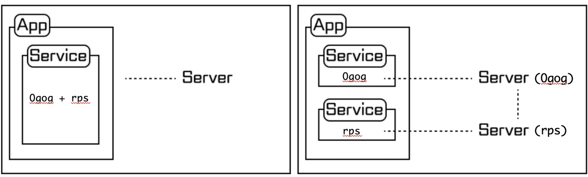

기존 앱은 하나의 next app에서 라우팅으로 오글톡 서비스와 래키바위보 서비스를 나누어 놓은 구조였습니다.

프로젝트 내부에서 컴포넌트가 세분화되어 있긴 했지만 이러한 구조에서는 빌드 및 배포 또한 한번에 할 수밖에 없었기 때문에, 오글톡의 수정 사항이 생길 때마다 래키바위보에도 영향을 받게 되어 분리가 필요하다고 판단했습니다.

마침 작년 즈음부터 마이크로 프론트엔드 아키텍처를 적용해 보고 싶다는 생각을 하던 차에, 좋은 기회라 생각되어 모노레포 방식을 적용해 보기로 결심하였습니다.

## 모노레포란?

“A monorepo is a single repository containing muliple distinct projects, with well defined relationships.”
“모노레포란 잘 정의된 관계를 가진, 여러 개의 독립적인 프로젝트들이 있는 하나의 repository이다.”

### 모노레포의 장점

- 새 프로젝트의 생성 비용이 적다.
- 프로젝트 간 코드 공유가 쉽다.
- 소스 분리가 편리하다.
- 하나의 커밋으로 repository를 관리할 수 있다.
- 히스토리 관리가 쉽다.
- 일관적인 개발자 경험을 제공한다.
- 빌드 및 배포 시 각각의 프로젝트에 영향을 미치지 않는다.

이러한 장점들만으로도 아키텍처 변경을 시도할 만한 이유는 충분하였습니다.

모노레포를 적용하는 방식 및 지원하는 도구는 다양했는데, 우리 회사의 on-premise 환경에서 지원하는 pnpm과 현재 프로젝트에서 사용 중인 next, typescript 등 여러 가지 사항을 고려했을 때 turborepo를 사용하는 것이 가장 적합하다고 판단하였습니다. 그리고 옆 팀에서 개발 중인 디자인 시스템에서도 turborepo를 채택했기 때문에, on-premise 환경에 배포를 실패할 리스크가 확 줄어든다는 점에서 부담이 줄어든 이유도 있었습니다.



기존 구조에서는 오글톡과 래키바위보 서비스를 하나의 서버(포트)에 띄웠으며, 기능 중 일부를 수정해 배포하면 서비스 전체가 새로 배포되는 과정을 거칩니다.

오른쪽 그림의 마이크로 프론트엔드 구조에서는 오글톡, 래키바위보 프로젝트를 각각의 서비스로 분리하여 서버(포트)를 별도로 띄우기 때문에 일부 코드만 수정해서 별도로 배포가 가능합니다.

## 프로젝트 구조

저는 turborepo에서 제공하는 bolierplate로 프로젝트를 생성하였습니다.

```shell
npx create-turbo
```

이렇게 하면 다음과 같은 구조로 프로젝트가 생성됩니다.

```shell
├──packages (공유 파일)
	└── ui
├──apps (서비스)
	├── docs
	└── web
```

저는 채팅플랫폼 성격에 맞게 다음과 같이 구조를 변경하였습니다.

```shell
├──packages (공유 파일)
	├── shared (공통 비즈니스 로직)
		└── types
		└── enum
		└── hooks
		└── api
		└── utils
	└── ui (공통 ui 컴포넌트)
		└── atom
		└── molecule
		└── template
		└── popup
		└── toast
├──apps (서비스)
	├── ogog (next)
	├── rps (next)
	└── ... (확장 가능)
```

[개발 포스팅](https://jayoon-kong.github.io/chat-develop)에서 언급한 것과 같이 각 프로젝트에서 가져다 쓸 수 있는 공통 비즈니스 로직과 공통 ui 컴포넌트를 분리하여 `packages` 내부에 포함시켰습니다.

이제 이 컴포넌트를 각 프로젝트에서 어떻게 import할 수 있는지 알아보겠습니다.

## 의존성 설정

`apps` 폴더 내부에 있는 각 `app`의 `package.json`을 살펴보면, `dependencies` 항목에 다음과 같이 정의가 되어 있습니다.

```javascript
"dependencies": {
  "@repo/shared": "workspace:*",
  "@repo/ui": "workspace:*",
}
```

여기서 `@repo/shared`, `@repo/ui`는 `packages` 내부에 있는 `shared`와 `ui`에서 정의된 이름입니다. 그리고 `workspace:*`의 의미는 pnpm에서 제공하는 기능으로, 같은 작업 공간 내에서 의존성을 관리할 때 사용됩니다. 즉 해당 패키지가 작업 공간 내에서 사용 가능한 모든 버전을 허용한다는 의미입니다.

따라서 이 코드는 현재 작업공간에 있는 `@repo/shared`와 `@repo/ui` 패키지를 의존성으로 추가하겠다는 의미입니다.

다음으로는 `app`의 `next.config.mjs`에서 특정 패키지에 있는 코드를 변환(ES6)할 수 있도록 설정해 줍니다.

```shell
transpilePackages: ["@repo/ui", "@repo/shared"]
```

마지막으로 `app`의 `tsconfig.json`에서 해당 이름으로 import를 해올 수 있도록 추가해 줍니다.

```shell
"paths": {
  "@/*": ["./*"]
}
```

이제 `app`의 컴포넌트에서 `packages`의 컴포넌트를 불러올 수 있습니다.

```javascript
import useLog from "@repo/shared/src/hooks/useLog"
```

## 빌드 설정

오글톡과 래키바위보를 분리하여 빌드하고 배포하기 위해서, `root`에 있는 `package.json`에 따로 설정을 추가하였습니다.

```javascript
"scripts": {
  ...,
  "dev:ogog": "turbo dev --filter ogog",
  "dev:rps": "turbo dev --filter rps",
  "start:ogog": "turbo start --filter ogog",
  "start:rps": "turbo start --filter rps",
  "build:ogog": "turbo build --filter ogog",
  "build:rps": "turbo build --filter rps",
  ...
}
```

이렇게 하면 원하는 프로젝트별로 따로 실행 및 빌드가 가능합니다.

```shell
pnpm dev:ogog
```

젠킨스에서 기존에 사용하던 빌드 설정을 프로젝트 갯수만큼 분리하여, 기존의 `npm run start` 대신 `pnpm run start:ogog`과 같은 형태로 바꿔 주기만 하면 빌드 설정은 끝납니다. 생각보다 아주 간단합니다.

## 배포 설정

같은 도메인에서 각 프로젝트를 어떻게 띄울까에 대한 고민을 하다가, ChatGPT의 조언에 따라 프로젝트별로 port를 따로 설정하여 기존 URL로 redirect하는 방식을 사용하기로 결정하였습니다.

즉, 기존에는 하나의 next 프로젝트에서 라우팅 기반으로 ogog과 rps가 나눠져 있었기 때문에 https://도메인/ogog, https://도메인/rps 이런 식으로 URL이 자연스럽게 구성되었는데요, 이제는 next 프로젝트가 별도로 나눠졌기 때문에 기존 방식으로는 URL을 사용할 수 없었습니다.

이에 각 프로젝트별로 3001, 3002번 포트를 따로 설정하여 실행되도록 하고, nginx에서 각 포트와 서비스명을 매핑시켜 리다이렉트하는 구조로 설정하였습니다.

우선 각 프로젝트의 `package.json` 파일에서 script 설정을 해 줍니다.

```javascript
// ogog > package.json
"scripts": {
  "dev": "NEXT_PUBLIC_MODE=DEV next dev --turbo --port 3001",
  ...
},
// rps > package.json
"scripts": {
  "dev": "NEXT_PUBLIC_MODE=DEV next dev --turbo --port 3002",
  ...
}
```

다음으로는 nginx에서 redirect를 위한 설정을 해 줍니다.

```shell
upstream frontend_ogog {
    server localhost:3001 max_fails=3 fail_timeout=15s;
    keepalive 20000;
}

upstream frontend_rps {
    server localhost:3002 max_fails=3 fail_timeout=15s;
    keepalive 20000;
}
```

```shell
location /ogog {
    proxy_pass http://frontend_ogog;
    proxy_set_header Host $host;
    proxy_set_header X-Real-IP $remote_addr;
    proxy_set_header X-Forwarded-For $proxy_add_x_forwarded_for;
    proxy_set_header X-Forwarded-Proto $scheme;
}

location /rps {
    proxy_pass http://frontend_rps;
    proxy_set_header Host $host;
    proxy_set_header X-Real-IP $remote_addr;
    proxy_set_header X-Forwarded-For $proxy_add_x_forwarded_for;
    proxy_set_header X-Forwarded-Proto $scheme;
}
```

이렇게 설정하고 기존 도메인으로 접속하면, ogog 또는 rps로 들어왔을 때 설정해 둔 각 포트(3001, 3002)로 실행이 되면서 각 서비스가 정상적으로 작동하는 것을 확인할 수 있었습니다.

## 이슈

### 이슈 1. pathname

기존에는 hook에서 사용하는 공통 로직이 next 프로젝트 내부에 있었기 때문에, `next/navigation`에서 제공하는 `usePathname`을 통해 편리하게 path 이름을 가져오고 있었는데요.

이제 `packages`로 빠진 컴포넌트에서는 `usePathname`을 사용하지 못해, 기존 `window`에서 제공하는 `location`의 `pathname`을 사용하도록 변경하였습니다.

### 이슈 2. CORS 오류

```shell
개발서버에서는 서버 설정으로 CORS를 따로 허용해 줘야 하는데요, 이번에 nginx에 location을 따로 추가하였기 때문에 해당 설정도 추가로 허용해 줘야 합니다.

location /ogog {
    add_header 'Access-Control-Allow-Origin' '*';
    if ($request_method = 'OPTIONS') {
        add_header 'Access-Control-Allow-Methods' 'GET, POST, DELETE, PATCH, OPTIONS';
        add_header 'Access-Control-Allow-Headers' '*';
        add_header 'Access-Control-Allow-Credentials' 'true';
        return 204;
    }
    proxy_pass http://frontend_ogog;
    proxy_set_header Host $host;
    proxy_set_header X-Real-IP $remote_addr;
    proxy_set_header X-Forwarded-For $proxy_add_x_forwarded_for;
    proxy_set_header X-Forwarded-Proto $scheme;
}

location /rps {
    add_header 'Access-Control-Allow-Origin' '*';
    if ($request_method = 'OPTIONS') {
        add_header 'Access-Control-Allow-Methods' 'GET, POST, DELETE, PATCH, OPTIONS';
        add_header 'Access-Control-Allow-Headers' '*';
        add_header 'Access-Control-Allow-Credentials' 'true';
        return 204;
    }
    proxy_pass http://frontend_rps;
    proxy_set_header Host $host;
    proxy_set_header X-Real-IP $remote_addr;
    proxy_set_header X-Forwarded-For $proxy_add_x_forwarded_for;
    proxy_set_header X-Forwarded-Proto $scheme;
}
```

이렇게 하니 모든 설정이 잘 된 것을 확인할 수 있었습니다.

## 마무리

소스를 마이그레이션하는 과정에서 사소한 삽질도 많았고, 환경 설정을 할 때 초반에 잘 되지 않아서 시간을 많이 소모하기도 했지만 이렇게 성공하고 나니 매우 뿌듯했습니다. 무엇보다도 **각 프로젝트의 빌드 및 배포 시 다른 프로젝트에 영향을 미치지 않는다는 점**이 큰 성과였습니다.

플랫폼을 더 플랫폼답게 만드는 작은 한 걸음이 되었다고 생각합니다.

앞으로 편리하게 다른 프로젝트를 확장할 수 있고, 또 기존에 사용하던 공통 컴포넌트의 히스토리/버전 관리 및 새로운 기술 적용 등을 용이하게 할 수 있다는 점에서 의미가 있는 작업이었던 것 같습니다.
