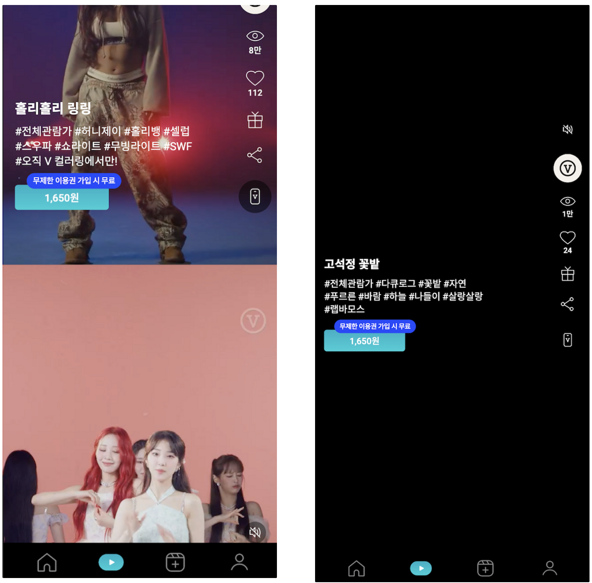

V 컬러링은 플레이어에서 안드로이드와 iOS의 비디오 렌더링 방식이 다르게 구현되어 있습니다. 초기 구현 시에는 OS 구분 없이 공통적으로 처리를 했는데, 먼저 재생될 영상의 앞뒤로 영상 정보를 가져오고 스와이프 내부에서 비디오를 렌더링하면서 위아래로 스와이핑을 할 때 이미 가져온 이전 영상과 다음 영상을 미리 준비함으로써 사용자에게 보다 빠르게 비디오를 보여주도록 되어 있습니다.

하지만 이렇게 하면 iOS의 경우 소리가 재생되지 않는 이슈가 발생합니다. 그 이유는 iOS의 정책적인 이유로 사용자가 액션을 취하기 전까지는 음소거로 플레이를 하는 것이 원칙이기 때문입니다. 틱톡이나 다른 동영상 플랫폼과 같이 V 컬러링도 사용자가 화면에 진입한 순간 자동 재생이 되도록 되어 있고, 사용자가 소리를 켠 상태에서 스와이핑을 하면 소리가 켜진 채로 플레이가 되어야 하는데 iOS에서는 그렇게 하면 play 오류가 발생하게 됩니다. 따라서 오류가 발생하면 자동으로 음소거 모드로 진입하여 다시 플레이하게끔 초창기에 구현을 했었죠. 하지만 그렇게 하면 사용자가 너무 불편하고 어색할 것 같아, iOS의 경우에는 스와이프 안에서 비디오를 렌더링하지 않고 세부 정보 (태그나 좋아요 등 기타 기능) 만 가져오도록 하고 비디오는 따로 가져오는 방법을 사용했습니다. 비디오는 스와이프 외부에서 렌더링하며, 하나씩 가져올 때마다 음소거를 해제하여 재생하는 방식을 사용함으로써 사용자가 스와이핑을 할 때 자연스럽게 소리가 나오는 상태로 자동 재생이 되도록 한 것이죠.

그런데 이렇게 하면 한 가지 문제가 발생합니다. 안드로이드는 스와이프 안에 비디오 정보가 들어있기 때문에 사용자가 스와이핑을 할 때 아래위 영상(썸네일)이 자연스럽게 노출되는 반면, iOS는 따로 렌더링이 되기 때문에 사용자가 스와이핑을 하는 순간 영상 정보가 사라집니다. 사실 이 이슈는 iOS 버전이 15로 업데이트되면서 발생했던 화면 깜박임 이슈를 해결하는 과정에서 발생한 side effect입니다. 대부분의 동영상 플랫폼에서 구현되어 있는 것처럼 비디오가 로드되기 전 사용자에게 빈 화면을 보여주지 않기 위해 먼저 썸네일을 깔아 두는데, 썸네일이 비디오로 전환되는 과정에서 화면을 다시 그릴 때 OS에서 자연스럽게 처리하지 못하고 깜박임 효과를 주는 것처럼 렌더링을 하는 이슈였습니다. 그 현상을 해결하기 위해 스와이핑 시 배경을 없애도록 처리하였는데 자세한 내용은 아래 포스트를 참고해 주세요.

[iOS15에서 비디오 재생 직전 화면이 깜박이는 현상](https://jayoon-kong.github.io/ios15-rendering/)


(좌) 안드로이드 (우) iOS

위에서 언급한 깜박임을 해결하기 위해 최종적으로 사용된 코드는 다음과 같습니다.

```javascript
const objectFit: 'contain' | 'cover' = useMemo(() => 
	(direction === 'HORIZONTAL' ? 'contain' : 'cover'), 
[direction]);

const loadedStyle = useMemo(() => (loaded ? { objectFit } : 
	{ display: 'none' }), 
[loaded]);

{!loaded && }
<video className='contain' style={loadedStyle} 
	onLoadedData={() => setLoaded(true)}
/>
```

원인을 오랫동안 생각해 보았으나 쉽게 답이 떠오르지 않았습니다. 로드가 되었을 때는 비디오가, 되지 않있을 때는 썸네일이 나타나게 되는데 왜 스와이핑 중에는 보이지 않는 걸까? 그래서 `setLoaded`를 하는 시점을 찾아보니 slide가 change될 때 `moving` 속성을 함께 관리하고 있다는 사실을 알게 되었습니다.

```javascript
sliderMove: () => {
  setMoving(true);
}
```

기존 코드를 살펴보니 `loaded` 값만으로 체크가 되지 않아 `moving`도 함께 체크를 하고 있었습니다. (`loaded`는 video의 기본 속성인 `onLoadedData` 값과 연동이 됩니다.) 그래서 `!loaded && moving` 조건일 때 이미지가 보이도록 하고 그렇지 않을 경우 비디오가 보이도록 하고 있었던 것이죠.

그래서 `moving` 값을 체크하지 않으면 어떻게 될까 하여 `moving` 상태를 모두 없애 보았으나 딱히 해결이 되지 않았습니다. 그러던 와중 썸네일만이라도 swiper 안에 넣어 보는 것이 어떨까 하는 생각이 떠올랐습니다. 재생 이슈가 있는 것은 비디오였기 때문에 이미지는 안드로이드와 동일하게 미리 가지고 있으면 좋을 것 같았습니다.

아래와 같이 swiper 내부에 이미지 코드를 넣고, video 앞의 이미지 코드는 제거하였습니다.

```html
{!loadedForIOS && }
```

이렇게 했더니 슬라이드 전환이 끝나기 전까지는 기존 영상의 썸네일이 그대로 남아있는 것을 확인할 수 있었습니다. 우선 빈(까만) 화면이 보이는 것보다는 훨씬 안정적인 느낌이 들더군요.

하지만 어쩐지 안드로이드와 동일하게 처리할 수 있는 방법이 분명 있을 것 같아 계속 미련이 남아 코드를 좀더 들여다 보았습니다. 그랬더니 제가 깜박임 이슈를 처리하는 과정에서 `moving` 값을 누락한 사실을 발견하게 되었습니다. 역시 추측대로 `moving`이 원인이었던 것이죠. 그래서 `loaded` 값만으로 체크하던 이미지와 비디오 렌더링 처리에 `moving` 값을 추가하였습니다.

```javascript
//image
{(!loadedForIOS || moving) && (
	
)}

//video
const loadedStyle = useMemo(() => 
	(loaded && !moving ? { objectFit } : { display: 'none' }), 
[loaded, moving]);
```

두근거리는 마음으로 테스트를 했는데 정말 거짓말처럼 스와이핑 시 직전/직후의 썸네일이 나타났습니다! 심지어 화면이 깜박이던 이슈도 여전히 해결된 상태였고, 재생 모드로 스와이핑을 해도 전혀 문제 없이 아주 부드럽게 잘 동작하는 모습이었습니다.

### 마무리

결과적으로는 화면이 깜박거리는 현상과 스와이핑 중 썸네일이 사라지는 두 현상 모두 `loaded`와 `moving`의 상태 값, 그리고 이미지를 로드하는 위치, `object-fit` 등의 조합으로 해결할 수 있는 문제였습니다.
이번 경험을 통해 문제 해결에 접근하는 시야를 좀더 넓게 가질 수 있었고, 성능 최적화라는 목표를 향해 한 걸음씩 나아가며 이슈를 해결하는 여러 가지 방법을 터득할 수 있었습니다.
그리고 이러한 고민과 노력의 과정이 결국은 사용자에게 더 나은 경험을 제공하고, 서비스의 품질을 높이는 데 많은 기여를 한다고 생각합니다. 😊