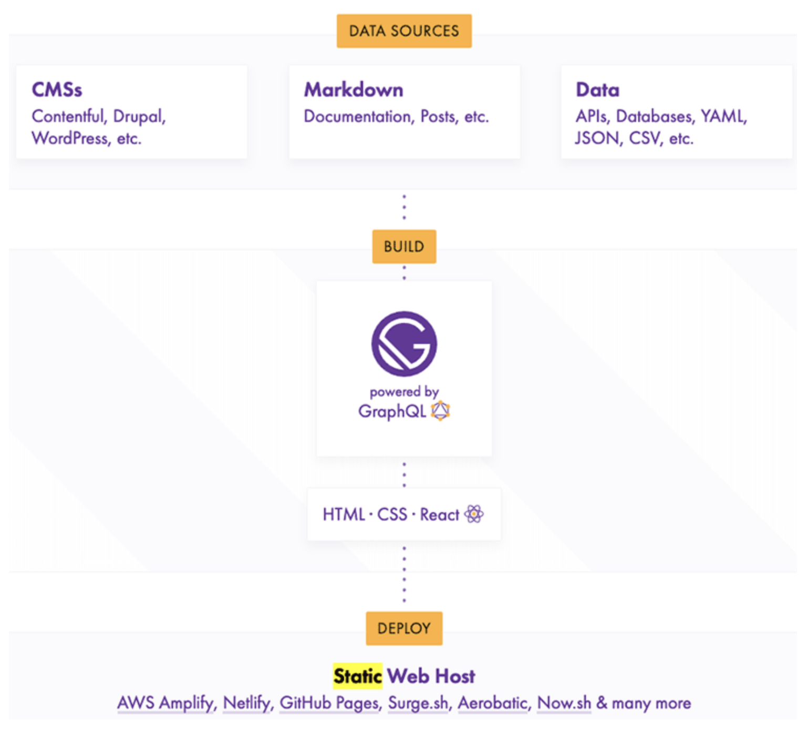
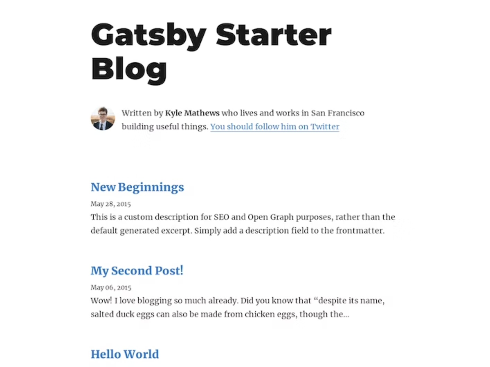
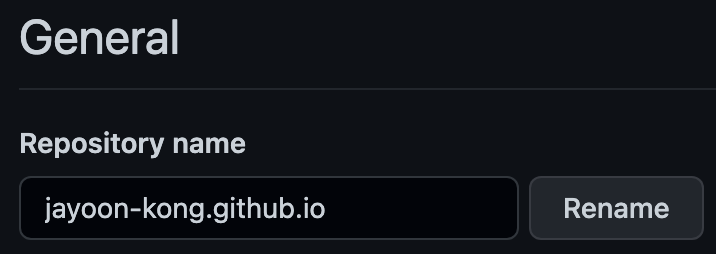
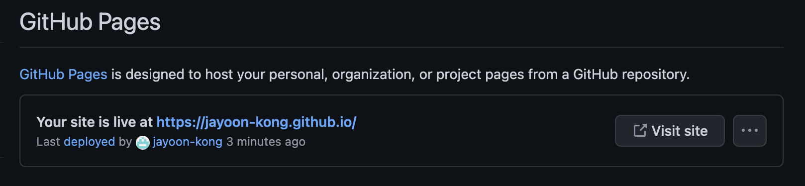
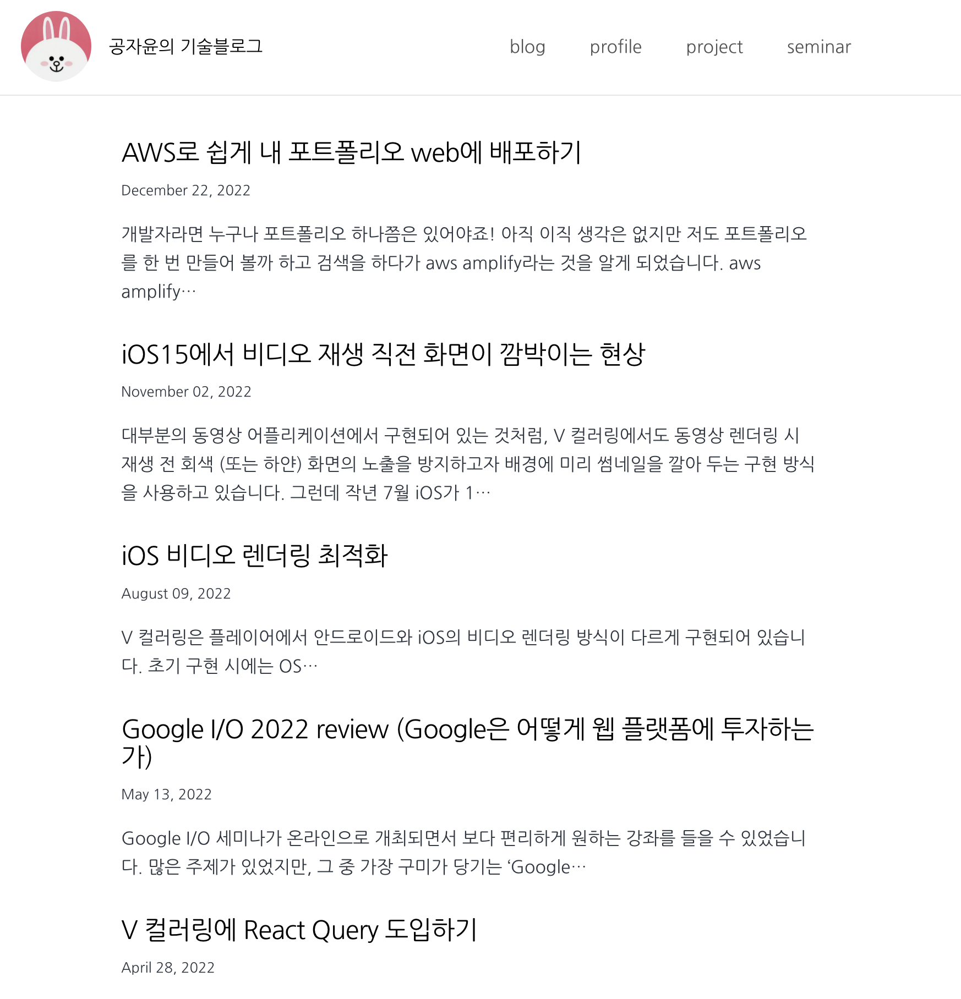
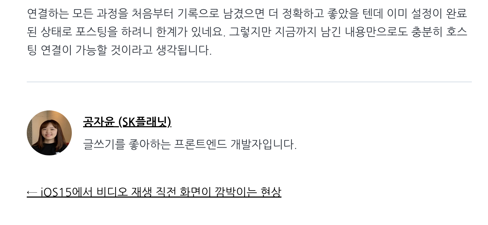
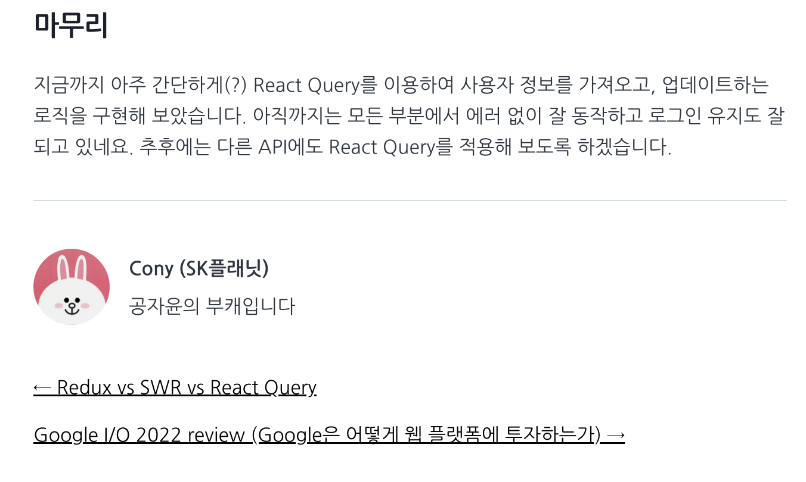

회사에서 기술 블로그를 만든다는 소식을 듣고, 데모 사이트를 한 번 만들어 보기로 하였습니다.

가독성이 좋고 코드 블록 사용이 가능해야 하며, 심플하면서도 효율적으로 (적은 비용으로 빠르게!) 만들어야 한다는 요구사항에 따라 리서치를 해본 결과, 서버나 DB 없이도 빠르게 정적 사이트를 만들고 배포할 수 있는 솔루션이 있다는 것을 알게 되었습니다.

가장 많이 사용하는 것이 Jekyll과 Gatsby였는데요, 저는 React가 편하기 때문에 React로 되어 있는 Gatsby를 사용하기로 하였습니다. (리서치에 도움을 주신 jojiiiiiyoung님께 ~~혹시 이 글을 보신다면~~ 감사의 말씀 전해드립니다!)

Gatsby는 React와 GraphQL을 이용하여, Markdown 형태의 파일을 빠르게 새로운 HTML로 빌드해 주는 정적 사이트 생성기(Static Site Generator)입니다. 아래 그림을 보면 이해가 쉽습니다.



Gatsby를 사용해서 만들면 github 사이트에 배포하는 것까지 아주 쉽고 편리하게 할 수 있습니다. 실제로 데모 사이트를 만드는 데 (배포 삽질 포함해서) 단 이틀밖에 걸리지 않았습니다. 데모 사이트는 여기를 참고해 주세요. 

([공자윤의 기술 블로그](https://jayoon-kong.github.io))

Gatsby에서는 수많은 템플릿을 지원하고 있는데요, 저는 가장 많이 쓰이는 Gatsby-starter-blog 테마를 사용하였습니다. 정말 깔끔하면서도 기본적인 기능은 거의 다 지원하고 있더라구요. 실제로 사용하면서 디자인 커스터마이징을 하기도 무척 쉬웠습니다.

우선 Gatsby를 사용하기 위해서는 Node.js 18 버전 이상이 필요하여 노드 버전을 업데이트하였습니다.

그리고 gatsby-cli를 설치해 주었습니다.

```powershell
npm i gatsby-cli -g
```

다음으로는 Gatsby-starter-blog 테마를 이용하여 저의 블로그를 로컬에 생성하였습니다.

```powershell
gatsby new jayoon-blog https://github.com/gatsbyjs/gatsby-starter-blog
```

(jayoon-blog는 프로젝트 이름, 뒤의 주소는 선택하고 싶은 테마입니다. Gatsby에서는 무수히 많은 블로그용 테마를 제공하고 있습니다.)

생성된 jayoon-blog 폴더를 열고 `npm run start`를 하면 아래와 같은 사이트가 나옵니다.



아주 심플하게 타이틀과 저자 소개, 그리고 3건의 포스팅으로 구성이 되어 있었습니다. 처음에 마크다운이라는 것을 모르고 글 등록을 어떻게 해야 하나 한참을 찾아보았는데요, 마크다운 파일을 생성해서 그냥 정해진 경로에 업로드만 하면 저렇게 사이트에 배포가 되는 구조였습니다. 

시험삼아 기존 노션에 있던 포스팅 중 몇 개를 가져와 마크다운(.md) 파일로 생성해 보았습니다. 헤드라인 및 이미지, 코드 블록 등의 스타일도 잘 되어 있고 가이드도 친절해서 어렵지 않게 작성할 수 있었고, 노션에서 쓸 수 있는 기능은 거의 제공되었기 때문에 가독성 있고 깔끔하게 작성이 가능하였습니다.

다음은 호스팅을 위해 github에 새로운 계정으로 가입하였습니다. github은 public으로 저장소를 생성하면 무료로 [github.io](http://github.io) 주소를 제공해 주는데요, 만약 ${내 계정}.github.io 주소를 이용하고 싶다면 저장소 이름을 반드시 `${내 계정}.github.io` 형태로 저장해야 합니다.



이렇게 저장을 하고 조금 기다린 후, Settings의 pages 메뉴로 들어가면 다음과 같이 내 사이트가 생성된 것을 확인할 수 있습니다.



로컬 저장소를 github에 연결하고 commit 및 push를 하였습니다. 기존에 포트폴리오용으로 사용하던 AWS Amplify는 사실 여기까지만 하면 바로 배포가 실행되었는데, github은 그렇게 하기 위해서는 몇 가지 작업을 더 해줘야 합니다. (Github Action을 사용해서 yml 파일을 생성하면 자동배포가 가능합니다.)

우선 저는 수동 배포를 하기 위해 gh-pages라는 라이브러리를 설치하고,  `package.json`에 deploy 명령을 추가해 주었습니다.

```powershell
npm i gh-pages --save-dev
```

```javascript
"scripts": {
	"deploy": "gatsby build && gh-pages -d public -b gh-pages"
}
```

이 명령어는 빌드를 한 이후에 gh-pages라는 브랜치로 배포를 하겠다는 의미입니다. 저는 처음에 왜 gh-pages로 해야 하는지 모르고 로컬 master에서 그냥 원격 master 브랜치로 배포했는데요, 그랬더니 제 소스들은 온데간데없이 사라지고 master 브랜치에는 chunk 형태의 정적 파일들이 잔뜩 들어가 있는 모습을 볼 수 있었습니다. 검색해 보니 Gatsby에서는 모든 정적 파일들을 기본 브랜치에 저장하도록 되어 있다는 사실을 알게 되었습니다. (이 과정에서 가장 시간이 많이 걸렸습니다.) 그래서 gh-pages라는 브랜치를 생성하고, 배포가 되는 기본 브랜치를 gh-pages로 설정한 후, master에서 작업한 파일을 gh-pages로 배포하도록 처리해 두면 master 브랜치는 깨끗한 소스로 관리되고 정적인 리소스들은 gh-pages 브랜치로 올라가기 때문에 쉽게 형상관리를 할 수 있습니다.

(추후에는 yml 파일을 등록하여 merge 시 자동 배포가 되도록 처리할 예정입니다.)

일단 npm run deploy로 원격 저장소에 push된 버전의 소스를 배포하였습니다. (디자인 요소들은 조금씩 수정했고, 헤더는 추가로 개발한 상태입니다.)



이렇게 깔끔하게 기술블로그가 탄생하게 되었습니다. 😎

글을 클릭하면 포스팅 상세 페이지로 이동을 하게 됩니다. 마크다운 파일이 위치한 폴더 이름이 URI의 pathname이 되고, 모든 파일이 html로 빌드되기 때문에 검색엔진에 노출이 가능합니다.

아래에는 저자 정보도 소개가 되는데 이 부분 역시 템플릿에서 쉽게 수정할 수 있습니다.



회사용 블로그에서는 저 말고 다른 저자들의 정보가 등록될 수 있어야 하기 때문에 샘플로 멤버 리스트를 만들어 보았습니다. js 파일마다 위치한 graphQl 쿼리를 이용하여 정보를 가져올 수 있습니다.



마크다운 파일에 데이터만 잘 등록해 주면 아주 쉽게 위와 같이 구현이 가능합니다.

이로써 블로그를 만들 준비를 모두 마쳤습니다. 이제 디자인 적용과 개발자를 위한 템플릿 작성 가이드, 그리고 운영자를 위한 배포 가이드만 만드는 일만 남았네요.