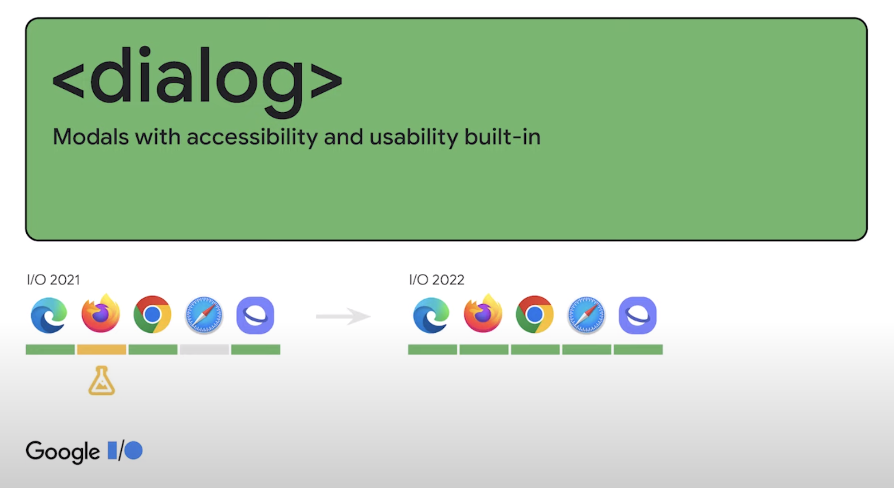
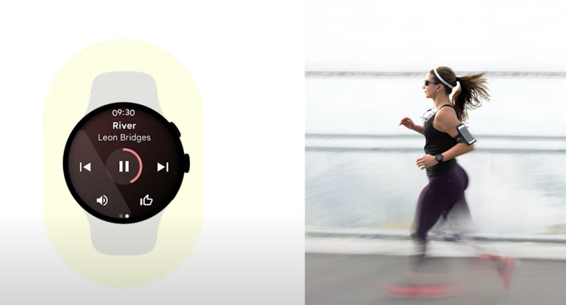
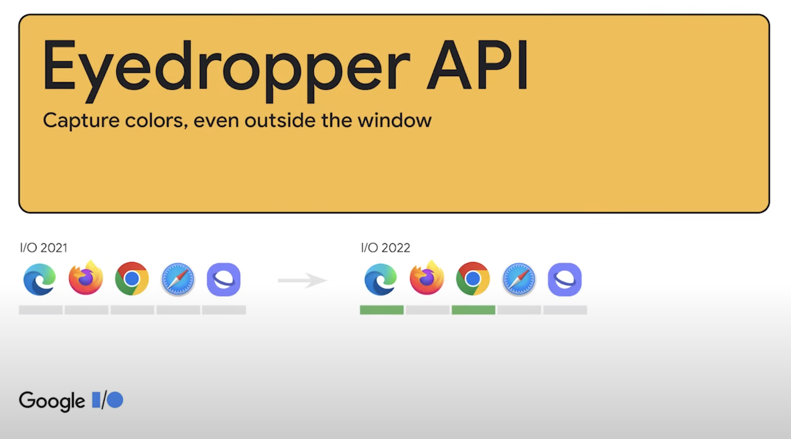

Google I/O 세미나가 온라인으로 개최되면서 보다 편리하게 원하는 강좌를 들을 수 있었습니다. 많은 주제가 있었지만, 그 중 가장 구미가 당기는 ‘Google은 어떻게 웹 플랫폼에 투자하는가'라는 세션을 집중적으로 들어 보았습니다. 재미있어 보이기도 했고, 프론트엔드 업무와 연관이 있기도 해서였습니다.


30분에 걸친 세미나였는데요, 한 가지 주제를 가지고 쭉 설명을 하는 것이 아니라 여러 사람들이 번갈아 가면서 다양한 내용을 아주 짧게(약 1-2분) 핵심만 설명하는 형태의 세미나라 지루하지도 않고 처음부터 끝까지 흥미롭게 들을 수 있었습니다. html, css, 자바스크립트 등 다양한 영역을 주제로 정하였으며, 기존 기능의 브라우저 호환성에 대해서도 다루고 있습니다. (물론 영어라서 중간중간 알아듣기 매우 힘든 부분도 많았습니다.)

본 포스트에서는 제가 특별히 관심있게 들었던 몇 가지 사례를 소개해 보도록 하겠습니다.

### Dialog



첫 번째로 소개할 내용은 dialog의 cross browser 지원입니다. 기존에는 사파리와 파이어폭스에서 지원하지 않았던 기능이었으나 2022년에는 모두 지원 가능하도록 변경되었습니다.

```javascript
<dialog class='demo-dialog'>
	<p>Hello</p>
	<form method='dialog'>
		<button value='cancel'>Cancel</button>
		<button value='confirm'>Confirm</button>
	</form>
</dialog>

<button type='button' class='some-button'>Click me</button>

<script>
	const dialog = document.querySelector('.demo-dialog');
	const someButton = document.querySelector('.some-button');

	someButton.addEventListener('click', () => {
		dialog.showModal();
	});

	dialog.addEventListener('close', () => {
		console.log(dialog.returnValue);
	});
</script>
```

Hello 메시지와 cancel, confirm 버튼이 있는 간단한 dialog를 구현한 모습입니다. 아래 구글I/O 영상에서 캡쳐한 이미지는 스타일이 좀더 들어간 모습이지만 저는 그냥 간단하게 Click me라는 버튼으로 기능을 테스트해 보았습니다. 

먼저 버튼에 click 이벤트를 걸어 `dialog.showModal();` 코드를 실행해 주면 아래와 같이 팝업이 뜹니다.


그리고 close 이벤트에 `dialog.returnValue` 를 출력하도록 해 보면, 버튼을 클릭했을 때 팝업이 닫히면서 각 버튼의 이름이 콘솔에 찍히는 것을 확인할 수 있습니다. 이렇게 하면 상위 dialog에만 close 이벤트 리스너를 등록하는 깔끔한 코드만으로도 각 버튼의 close callback으로 return value를 손쉽게 얻을 수 있습니다.

이번에는 단지 return value를 얻는 것만으로 그치지 않고, 각 버튼을 클릭했을 때 callback function이 실행되도록 구현해 보겠습니다. 이 기능은 실제로 V 컬러링뿐만 아니라 다른 서비스에서도 매우 많이 사용되는 기능입니다.

```javascript
const handleCloseButton = (returnValue: string) => {
	if (returnValue === 'confirm') {
		successCallback();			
	} else {
		cancelCallback();
	}
};

dialog.addEventListener('close', () => {
	handleCloseButton(dialog.returnValue);
});
```

사용자가 버튼을 클릭했을 때 창이 닫히면서 버튼 종류에 따라 서로 다른 callback이 실행되도록 하였습니다. 기존에 사용 중인 코드와 어떻게 다른지 비교해 보도록 하겠습니다.

```javascript
<div className="pop-btn-module">
  {leftText || onLeftClicked ? (
    <button type="button" onClick={handleLeftClicked}>
      {leftText || '취소'}
    </button>
  ) : null}
  <button type="button" className="acc" onClick={handleRightClicked} autoFocus>
    {rightText || '확인'}
  </button>
</div>
```

V 컬러링에서 현재 사용되고 있는 공통 dialog의 코드입니다. 어떻게 다른지 한눈에 알 수 있죠? 각 버튼마다 클릭 이벤트를 각각 등록해준 모습입니다. 사실 코드의 양이나 가독성 측면에서 눈에 띄게 더 좋아졌다고는 볼 수 없지만, dialog.returnValue를 이용하면 상위 노드에 이벤트를 한 번만 등록함으로써 이벤트 위임이 가능하게 됩니다. (이벤트 위임의 이점에 대해서는 아래 간략히 기술하였습니다.)

> 참고 : 이벤트 위임의 이점
> 
- 동적인 엘리먼트에 대한 이벤트 처리가 수월하다.
    - 상위 엘리먼트에서만 이벤트 리스너를 관리하기 때문에 하위 엘리먼트는 자유롭게 추가 및 삭제할 수 있다.
- 이벤트 핸들러 관리가 쉽다.
    - 동일한 이벤트에 대해 한 곳에서 관리하기 때문에 각각의 엘리먼트를 여러 곳에 등록하여 관리하는 것보다 관리가 수월하다.
- 메모리 사용량이 줄어든다.
    - 동적으로 추가되는 이벤트가 없어지기 때문에 당연한 결과이다. 1000건의 각주를 등록한다고 생각해보면 고민할 필요로 없는 일이다.
- 메모리 누수 가능성도 줄어든다.
    - 등록 핸들러 자체가 줄어들기 때문에 메모리 누수 가능성도 줄어든다.

출처 : [https://ui.toast.com/weekly-pick/ko_20160826](https://ui.toast.com/weekly-pick/ko_20160826)

### Datetime-local


다음은 datetime-local입니다. html에서 기본적으로 제공하는 input 태그의 type으로 선언할 수 있습니다. 역시 파이어폭스와 사파리에서 지원 가능하게 되었기 때문에 이제 따로 캘린더를 구현할 필요 없이 편리하게 사용할 수 있습니다.


이렇게 간단한 코드로 날짜와 시간을 손쉽게 선택할 수 있습니다.

### Bfcache


페이지 로드 성능 개선을 위해, 브라우저에서 페이지 이동 시 잠시 동안 캐시를 보유하고 있는 기능이 엣지와 크롬에도 추가되었습니다. 페이지가 이동하는 동안, 이전 페이지가 잠시 유지되면서 사용자들에게 좀더 빠른 로딩을 제공하는 기능입니다. 


이렇게 Application의 devtool에서 캐시 저장 여부를 확인할 수도 있습니다.

### Lazy Loading


img 태그에 기본적으로 제공되던 loading의 lazy 기능이 사파리에서도 사용 가능하게 되었습니다. 브라우저 호환성을 위해 기본 속성을 사용하지 못하고 외부 라이브러리를 이용하여 구현하였던 많은 개발자들에게는 희소식이 아닐 수 없습니다. 아래와 같이 간단하게 loading=’lazy’ 한 줄만 넣어 줘도 lazy loading이 가능합니다.

```javascript

<iframe src='...' loading='lazy'></iframe>
```

lazy loading에 대해 더 알고 싶으신 분들은 아래 사이트를 참고하시기 바랍니다.

[https://web.dev/i18n/ko/browser-level-image-lazy-loading/](https://web.dev/i18n/ko/browser-level-image-lazy-loading/)

### Priority hint


이미지 또는 아이프레임의 노출 우선 순위를 결정하는 속성입니다. 여러 개의 이미지나 스크립트, 아이프레임 등을 불러올 때 상대적으로 중요하거나 먼저 보여주고 싶은 태그에 우선 순위를 부여하여 미리 로드되도록 할 수 있습니다.

```javascript


<script fetchpriority='high' src='important.js' async></script>
<script fetchpriority='low' src='less-important.js' async></script>

<iframe fetchpriority='high' src='/important'></iframe>
<iframe fetchpriority='low' src='/less-important'></iframe>

<script>
	fetch(url, { priority: 'low' });
</script>
```

fetchpriority의 속성은 다음과 같습니다.

- high: 다른 이미지 또는 아이프레임에 비해 높은 우선 순위로 fetch합니다.
- low: 다른 이미지 또는 아이프레임에 비해 낮은 우선 순위로 fetch합니다.
- auto: 디폴트 모드이며, 유저에게 가장 베스트라고 판단되는 순서로 브라우저가 판단하여 fetch합니다.


대용량 이미지일 경우 우선 순위를 높였을 때 보이는 시간의 차이가 나타납니다. 실제로 여러 이미지를 사용하는 경우 상당한 성능 개선 효과를 가져올 수 있습니다. script의 경우 async를 추가해 주면 우선 순위를 더욱 높일 수 있습니다.

아쉽게도 아직은 익스플로러 엣지와 크롬에서만 지원하는 기능입니다.

### Privacy and Security


보안 정책에 대한 발표도 있었습니다.


이번 발표에서는 타사의 쿠키 및 사이트 간 추적을 단계적으로 중단하여 사용자 개인 정보를 개선하고자 하는 노력에 대해 언급했습니다.


위 그림과 같이 사이트 내부에 로그인 상태를 관리하는 채팅 앱이 내장되어 있다고 가정해 보겠습니다.


사이트가 포함된 위치에 관계없이 고유한 단일 쿠키 세트를 갖도록 허용함으로써, 타사의 쿠키는 사라지게 됩니다. 이렇게 하면 개인 정보 보호에는 좋지만, 채팅에 자체 쿠키가 없으면 로그인 여부를 기억할 수 없어 매번 로그아웃이 되거나 다른 플랫폼 또는 사이트에서 도움을 받아야 할 경우 큰 문제가 될 수 있습니다.


쿠키의 유용한 부분은 보존하고 사이트 간 추적 부분은 제거하는 방법이 있다면 어떨까요?

이를 위해, 현재 독립적인 파티션 상태 또는 칩을 가진 쿠키를 실험하고 있습니다.

쿠키에 이렇게 Partitioned 속성을 넣으면, 쿠키는 차단되지 않지만 공유되지도 않습니다. 채팅 앱이 A 사이트에 임베드될 때 쿠키가 설정되어 있으면, 사이트가 A에 임베드된 경우에만 쿠키를 사용할 수 있습니다. 채팅 앱이 B 사이트에 임베드되면 완전히 다른 쿠키가 생성되므로, 여러 사이트에서 사용자를 추적하는 데 사용할 수 없습니다.  그러면서도 세션은 계속 유지할 수 있다는 장점이 있습니다.


위 기능은 아직 실험 중이며 일부 크롬에서만 제공하고 있습니다.

### WebAuthn


기존의 패스워드 방식의 인증 정책은 많은 보안 문제를 야기해 왔습니다. WebAuthn은 브라우저 및 사이트가 FIDO 표준에 기반한 외부 인증자 키를 사용할 수 있게 하는 웹 API를 정의합니다.


많은 브라우저에서 지원하고 있으며, 위와 같은 생체인증이 널리 사용되고 있습니다.

### Media Session API


웹에서도 앱과 같이 풍부한 플랫폼 경험을 할 수 있다면 좋지 않을까요? 예를 들어 데스크탑이나 모바일에 있는 대부분의 운영 체제에는 재생 중인 항목을 알려주고 일시 중지, 건너뛰기 및 찾기에 대한 제어를 제공하는 일종의 미디어 통합이 있습니다. 휴대전화에서는 노래가 재생되지만 시계에서는 미디어 컨트롤이 표시되는 것이죠.



Media Session API를 사용하면 웹을 통해 이 모든 작업을 수행할 수 있습니다.

```javascript
navigator.mediaSession.metadata = new MediaMetadata({
	title: 'Never Gonna Give You Up',
	artist: 'Rick Astley',
	album: 'Whenever You Need Somebody',
	artwork: [
		// ...
	],
});
```

Window, Mac OS, Android 및 iOS에서 미디어 컨트롤을 표시하고 이에 반응할 수 있습니다.

### Eyedropper API



사진에서 컬러를 추출할 수 있는 기능입니다.


사진에서 레서판다의 머리 부분을 선택했을 때 브라우저에 해당 컬러가 표시되고 있는 모습입니다. 크롬 및 엣지에서만 지원되는 것이 아쉽네요. 브라우저 호환성이 좋아지면 라이브러리 없이 쉽게 사진으로부터 컬러 값을 알 수 있으니 편할 것 같습니다.

### Structured cloning


```javascript
const clone = JSON.Parse(
	JSON.stringify(obj);
);
```

기존에는 객체의 깊은 복제를 위해서는 위와 같은 코드를 구현해야 했습니다.

```javascript
const clone = structuredClone(obj);
```

이제는 이렇게 간단히 한 줄로 깊은 복제가 가능합니다. 객체뿐 아니라 이미지, 비트맵, 배열과 같은 더 많은 것들을 복제할 수 있으며, 순환 참조가 있는 개체 구조를 복제할 수도 있습니다. 심지어 모든 브라우저에서 지원하는 기능이네요.

### CreateImageBitmap


```javascript
async function blobToImg(blob) {
	const url = URL.createObjectURL(blob);
	
	try {
		const img = new Image();
		img.src = url;
		await img.decode();
		return img;
	} finally {
		URL.revokeObjectURL(url);
	}
}
```

기존에는 blob 형태의 파일을 img로 변환하기 위해서는 위와 같이 코드를 복잡하게 짜야 했습니다.

```javascript
const blobToImage = (blob) => createImageBitmap(blob);
```

이제는 사파리에서도 지원하기 때문에 이렇게 한 줄로 손쉽게 구현 가능합니다.

아래와 같이 이미지가 로드되는 방식을 훨씬 더 많이 제어하는 것도 가능합니다. (2D 캔버스 및 WebGL용 텍스처를 로드하는 데에도 유용합니다.)

```javascript
createImageBitmap(blob, x, y, width, height, {
	colorSpaceConversion: 'none',
	resizeHeight: 640,
	resizeWidth: 480,
	resizeQuality: 'high',
	premultiplyAlpha: 'premultiplay'
});
```

- colorSpaceConversion: 색 공간 변환을 사용하여 이미지를 디코딩해야 하는지 여부를 지정함
- resizeHeight: 출력 높이
- resizeWidth: 출력 너비
- resizeQuality: 출력 크기와 일치하도록 입력 크기를 조정하는 데 사용할 알고리즘 지정
- premultiplyAlpha: 비트맵의 색상 채널에 알파 채널을 곱하는지 여부를 지정

그 밖에도 자바스크립트의 여러 기능들을 다양한 브라우저에서 지원 가능하게 되었습니다.


### Top level await

```javascript
<script type='module'>
	import { processData } from './utils.js';
	const dataResponse = await fetch('/data');
	processData(await dataResponse.json());
</script>
```

위와 같이 Javascript 모듈의 최상위 수준에서 await를 사용할 수 있습니다.

### Private properties, Private methods

```javascript
class Whatever extends EventTarget {
	#counter = 0;

	get counter() {
		return this.#counter;
	}
	#fireIncrementEvent() {
		this.dispatchEvent(new Event('increment'));
	}
	incrementCounter() {
		this.#counter++;
		this.#fireIncrementEvent();
	}
}
```

class는 이제 private 속성과 private method를 가질 수 있습니다.

### array.at

```javascript
const last = array[array.length - 1];

const last = array.slice(-1)[0];
```

배열의 마지막 항목을 얻기 위해 기존에는 이런 코드를 작성한 적이 있을 텐데요,

```javascript
const last = array.at(-1);
```

이제는 인덱스로 배열에서 항목을 가져오는 method가 생겼습니다. 음수 인덱스를 허용하기 때문에 끝에서부터 계산할 수 있습니다.

이 모든 것이 크로스 브라우징이 가능합니다.


2022년에는 브라우저 간에 동적이 완전히 상호 운용될 수 있도록 이 15가지 핵심 영역에 초점을 맞추는 것을 목표로 한다고 합니다.

### 마무리

원래는 두세 가지 기능에 대해서만 언급하려고 했는데 쓰다 보니 굉장히 길어졌네요. 한 가지 주제에 대해 오래 발표를 했다면 다소 지루할 수 있었을 텐데, 기능 설명 위주로 아주 빠르게 발표가 진행되다 보니 몰랐던 기능에 대해서도 많이 배울 수 있었던 유익하고 즐거운 시간이었습니다. 제가 소개하지 못한 다른 흥미로운 내용들도 많으니 가벼운 마음으로 풀 영상을 한번 보시는 것도 좋을 것 같습니다.

[Google I/O ‘What’s new for the web platform’ full 영상 링크](https://io.google/2022/program/3c60e411-5340-4c54-a037-3aceb2825b16/intl/ko/)