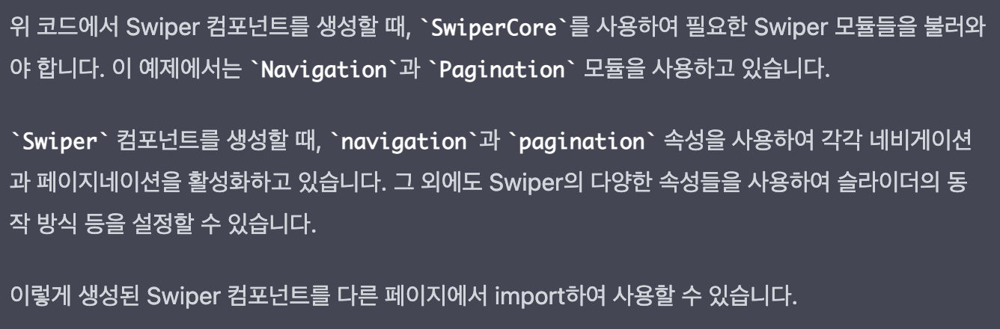

V 컬러링은 2020년에 처음 만들어진 SPA(Single Application Application) 형태의 모바일 웹입니다.
여러 번의 성능 최적화 작업을 통해 Client side rendering 방식을 사용하고 있음에도 불구하고 속도 측면에서 현재 Native 수준의 성능을 자랑하고 있지만, 3년 동안 수많은 운영 과제를 통해 코드 부채가 조금씩 쌓이면서 불필요한 코드도 많아지고 뭔가 좀더 잘 만들어 볼 수는 없을까? 하는 생각이 계속 과제처럼 따라다니고 있었습니다.

## 동기

운영과제만 하는 것이 지루해서 뭔가 혁신적으로 해볼 수 있는 게 없을까 계속 고민하다가 문득 (정말 갑자기) `Next.js`를 도입해 보는 것이 어떨까 하는 생각이 들었습니다.
부분적으로 리팩토링을 하거나 신규 기능에 한해서 아키텍쳐를 새로 설계할 수도 있겠지만, 오래된 라이브러리를 변경하거나 테스트 코드를 추가하기 위해서는 확실히 전면 개편이 필요하다고 판단하였습니다.
또한 코드를 모듈화하여 좀더 가독성 있고 유지보수가 쉽도록 만들고 싶었고, 무엇보다도 최초 아키텍쳐 설계를 제가 한 것이 아니었기 때문에 처음부터 끝까지 고민하여 정말 잘 설계된 V 컬러링을 스스로 만들어 보고 싶다는 욕심이 가장 컸습니다.

정리하자면 `Next.js`를 선택한 이유는 다음과 같습니다.

1. **SSR (또는 SSG) 와 CSR 방식을 모두 지원하는 프레임워크**
   1. 홈의 초기 뷰포트에 나타나는 부분 및 비디오 화면, 마이 화면 등의 렌더링은 SSR을 사용하면 더 빠를 것이라는 추측에서 부분적으로 SSR을 적용할 예정입니다.
      하지만 홈 화면의 스크롤 하단 영역 및 기타 사용자와의 interaction이 많은 부분은 여전히 CSR을 적용하여 위험 부담을 줄일 예정입니다.
2. **기존 React 코드 호환 및 신규 라이브러리 적용 가능**
   1. 기존의 코드를 최대한 재사용하면서도 api 공통이나 에러 처리 등은 새롭게 구현하고, swiper 등 오래된 모듈은 신규로 교체하여 사용성을 높일 예정입니다.
3. **테스트 코드 작성 가능**
   1. 현재 버전에 붙이면 에러가 나는 테스트 코드들을 적용하기 위해 버전을 업데이트하고, 테스트 코드를 용이하게 작성하기 위해 기능을 세분화할 예정입니다.
4. **이미지 레이지 로딩 및 링크 등의 성능 최적화 기능 제공**
   1. `Next.js`에서 자체적으로 제공하는 `Link` 및 `Image` 등의 기능을 통해 성능 최적화를 할 예정입니다.

## 프로젝트 생성 및 환경 설정

기존의 프로젝트에 Next를 설치하는 방법도 있었지만 일단 처음 시작해 보는 만큼 신규 프로젝트를 생성하였습니다.
typescript를 이용한 `Next.js` 설치 명령어는 다음과 같습니다.

```javascript
npx create-next-app --typescript vrbt-frontend-next
```

이렇게 하면 CRA를 생성할 때처럼 `next.js` 프로젝트가 생성됩니다.
저는 초기 설치 단계에서 ChatGPT의 도움을 많이 받았습니다.

`Next.js`에서는 이전에 사용했던 `Gatsby`와 동일하게 기본적으로 파일시스템 기반의 라우팅 방식이 사용됩니다.
pages 폴더 내부의 `index.tsx` 파일이 root directory가 되고, `_document.tsx` 파일이 기본 index.html의 역할을 하며, `_app.tsx` 파일은 CRA에서의 app.tsx 파일과 동일한 역할을 합니다.

라우터를 사용해야 하기 때문에 `_app.tsx` 파일 작성을 ChatGPT에 요청해 보았습니다.


생각보다 상세한 설명과 함께 예제를 작성해 주었습니다.
저는 여기에 공통으로 사용할 <Layout> 컴포넌트만 바깥에 감싸 주고, <Navbar />는 하단으로 옮기는 작업만 수행하였습니다.
그리고 기존의 css 파일들을 import해 주었습니다.

```javascript
import Layout from "../pages/components/Layout"
import { AppProps } from "next/app"
import { useRouter } from "next/router"

import "@/static/css/base.css"
import "@/static/css/common.css"
import "@/static/css/search.css"
import Navigation from "./components/Navigation"

const App = ({ Component, pageProps }: AppProps) => {
  const router = useRouter()

  // 라우팅 될 때마다 실행되는 함수
  const handleRouteChange = (url: string) => {
    console.log("Route changed:", url)
  }

  if (router) {
    router.events?.on("routeChangeStart", handleRouteChange)
  }

  return (
    <>
      <Layout>
        <Component {...pageProps} />
      </Layout>
      <Navigation router={router} />
    </>
  )
}

export default App
```

ChatGPT가 작성해준 코드와 별반 다를 것이 없죠? `Next.js`는 Hot reload 기능도 지원해 주기 때문에 결과가 바로 나타났습니다.
그리고 기존 컴포넌트들이 들어 있는 `src` 폴더와, font, css, images 등이 들어 있는 `static` 폴더는 그대로 복사해 왔습니다.

시험삼아 V 컬러링의 홈 부분 중 일부를 가져와 보았습니다. 헤더 부분과 하단 Navigation이 적용된 모습입니다.


아직 아무것도 없긴 하지만 어쨌든 성공적으로 렌더링된 모습을 볼 수 있습니다.

## REST API를 활용하여 SSR 페이지 생성하기

이번에는 상단 메인 배너를 SSR을 사용하여 가져와 보도록 하겠습니다.
역시나 ChatGPT에게 활용 방법을 물어보았습니다.


이미 공식 문서에서도 읽어보긴 했지만, SSR을 이용하기 위해서는 `getServerSideProps` 함수를 사용하면 됩니다.
이 함수를 사용하면 서버 사이드에서 외부 API를 호출할 수 있습니다.
또한 위 설명에도 나와 있듯이 이 함수 내에서는 `fetch`를 포함한 어떤 비동기 작업도 수행할 수 있습니다.

ChatGPT가 작성해 준 코드를 활용하여 배너를 가져오는 코드를 만들어 보았습니다.

```javascript
export const getServerSideProps: GetServerSideProps<Props> = async () => {
  try {
    const response = await fetch(`${baseURL}/v1/배너 가져오는 주소`, {
      method: "POST",
      headers: {
        "Content-Type": "application/json",
      },
      body: JSON.stringify({
        status: "DURING",
      }),
    })
    const data = await response.json()

    return { props: { data: data.data } }
  } catch (error) {
    return { props: { data: null } }
  }
}
```

아직 `fetch`의 공통 함수는 작성하기 전이라 우선적으로 위와 같이 작성하였습니다.

다음으로는 컴포넌트에서 받아온 `data`를 이용하여 UI를 그리는 작업을 수행하였습니다.

```javascript
// index.tsx
const Home = ({ bannersGroups }: Props) => {
  return (
    <div id="wrap" className="flx-sti-wrap">
      <Header />
      <section className="sch-main-cont" id="container">
        {bannersGroups.length &&
          <MainBanner bannersGroups={bannersGroups} />
        }
      </section>
    </div>
  )
};

// MainBanner.tsx
const MainBanner = ({ bannersGroups }: Props) => {
	...
  {bannersGroups.length &&
    bannersGroups.map((item, index) => {
      return (
        <Image className="item-banner" src={item.imgUrl} alt={item.name} ... />
      );
		})
  }
};

export default memo(MainBanner);
```

API 요청이 성공적으로 수행되어, bannersGroups의 갯수만큼 이미지가 잘 출력되는 것을 확인할 수 있었습니다.

## swiper library 설치

기존에 사용 중이던 `react-id-swiper` 라이브러리는 너무 오래된 버전이라 새로운 버전으로의 교체가 필요했습니다. `next.js`에서 사용하기 위해 이번에도 ChatGPT에게 물어보았습니다.




`swiper` library를 설치하고 코드를 다음과 같이 변경하였습니다.

```javascript
SwiperCore.use([Navigation, Pagination, Autoplay, Lazy])

const MainBanner = ({ bannersGroups }: Props) => {
  return (
    <Swiper
      className="swiper-container prog-box"
      pagination={{
        el: ".swiper-pagination",
        clickable: true,
      }}
      spaceBetween={16}
      speed={500}
      slidesPerView={1}
      loop={true}
      autoplay={{
        delay: 3000,
        disableOnInteraction: false,
      }}
    >
      {bannersGroups.length &&
        bannersGroups.map((item, index) => {
          return (
            <SwiperSlide key={`${item.bannersGroupId}_${index}`}>
              <div
                data-reactid={`${item.bannersGroupId}_${index}`}
                className="swiper-slide"
              >
                <Image
                  className="item-banner"
                  src={item.imgUrl}
                  alt={item.name}
                  width={358}
                  height={232}
                />
              </div>
            </SwiperSlide>
          )
        })}
    </Swiper>
  )
}

export default memo(MainBanner)
```

결과는 다음과 같습니다.


실제 V 컬러링과 매우 유사한 형태의 홈 화면이 만들어졌습니다!

다음 포스팅에서는 하단 네비게이션을 통한 라우팅 구현에 대해 알아보도록 하겠습니다.
