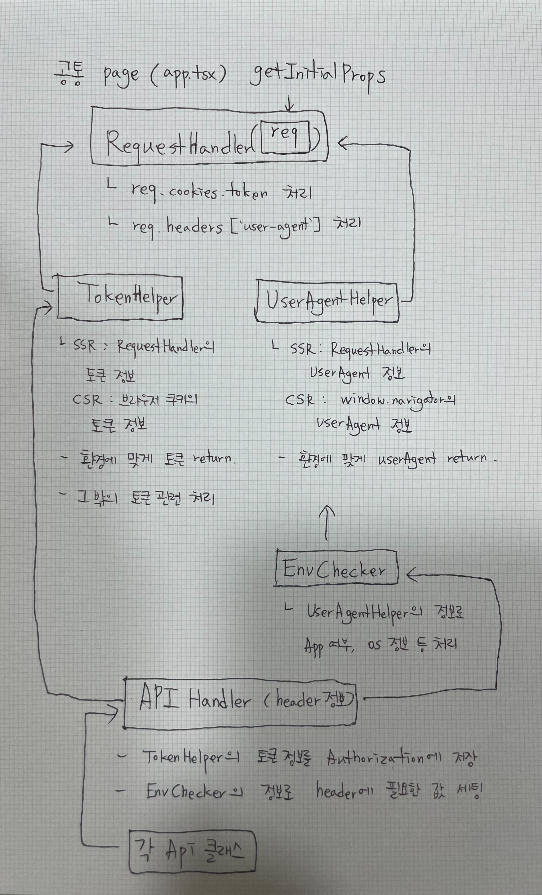

이번 포스팅에서는 공통 핸들러 처리에 대해 정리해 보도록 하겠습니다.

이전 포스트에서도 언급했듯이 현재 인증은 jwt 방식을 사용하고 있기 때문에 우선 공통적으로 **토큰**을 핸들링하는 과정이 필요했습니다.
또한 V 컬러링은 APP 여부 및 OS 등의 정보에 종속되는 기능이 많기 때문에 **userAgent** 관리 또한 필요했습니다.

토큰 같은 경우 기존에는 쉽게 로컬스토리지에 저장했다가 꺼내 쓰면 되고 userAgent는 `window` 객체로부터 손쉽게 가져올 수 있었지만, 개편된 구조에서는 SSR과 CSR 방식 모두에서 사용해야 했기 때문에 많은 고민이 필요했습니다.
토큰은 쿠키에 저장하긴 했지만 SSR과 CSR에서 가져오는 방식이 다르고, userAgent 역시 SSR인 경우 `window` 객체에 접근할 수 없기 때문에 `getServerSideProps`에서 넘어오는 context의 req 내부의 header 정보에서 가져와야 합니다.

고민 끝에 다음과 같이 도식화하였습니다. ~~(아날로그를 좋아하는 저는 아직 공책에 그림을 그립니다.)~~



서버 사이드 렌더링 시 데이터를 fetching할 경우 매번 토큰을 세팅하는 것이 번거로워, 우선 토큰 공통 처리를 하는 것부터 시작하였습니다.
처음에는 단순히 header의 config 정보에서 토큰을 처리하면 된다고 생각하여 axios instance에서 토큰 정보를 불러와서 다음과 같이 바로 세팅하는 방법을 사용하였습니다.

```javascript
// my.tsx
export const getServerSideProps: GetServerSideProps = async ({ req }) => {
  const queryClient = new QueryClient();

	// 쿠키에서 토큰 정보를 추출한 뒤 header의 Authorization에 추가해 줍니다.
  const token = req.cookies.token;
  if (token) {
    axios.defaults.headers['Authorization'] = `Bearer ${token}`;
  }
	...
}

// axiosInstance.ts
const getToken = () => {
  const auth = axios.defaults.headers.Authorization; // 디폴트 헤더 값을 먼저 가져옴
  if (auth) {
    return auth;
  }

  const token = Token.getToken(); // 없는 경우에 쿠키에서 직접 가져옴
  if (token) {
    return `Bearer ${token}`;
  }

  return null;
};

// 요청 인터셉터
instance.interceptors.request.use(
  (config) => {
    // 요청 전에 수행할 작업
    const token = getToken();
    if (token && !config.url?.includes('oauth')) {
      config.headers.Authorization = token;
    }
    return config;
  },
  (error) => {
    // 요청 오류 처리
    return Promise.reject(error);
  }
);
```

하지만 이렇게 하니 매번 페이지에서 토큰을 추출하여 axios의 header에 직접 박아 주거나, 아니면 req 정보를 axios에서 가지고 있어야 하는 번거로움이 있있습니다.
**페이지에서는 axios의 header에 접근할 필요가 없어야 하고, 또 API 핸들러에서는 토큰 정보를 가지고 있지 않도록 했으면 좋겠다**는 것이 설계의 가장 큰 목표였습니다.

`getServerSideProps`에서 받아 오는 req 정보를 어디선가 처리하고 싶다는 생각을 하던 즈음 일단 다음 단계로 넘어가 보기로 하였습니다.
V 컬러링 API 호출 시 요청 header에 넣어야 하는 고유값 중에 APP과 mWeb의 구분이 반드시 필요한 값이 있는데, 이를 위해서는 userAgent 정보를 가져와야 합니다.
userAgent의 값도 앞에서 언급한 것처럼 req의 headers 정보로부터 받아올 수 있습니다.

req 정보로부터 받아온 쿠키(토큰) 값과 헤더(userAgent) 값을 한번에 처리하면 좋겠다는 생각이 들어 RequestHandler를 구현하였습니다.
여기서는 단순히 req 값의 정보를 세팅하고 리턴하는 작업을 수행합니다.
그리고 공통 페이지인 `_app.tsx`에서 RequestHandler를 호출하여 토큰과 userAgent 값을 세팅하였습니다.

여기서 받아온 토큰 값과 userAgent 값을 모두 API 핸들러에서 사용해야 하기 때문에(헤더에 저장), 렌더링 방식에 따라 값을 리턴해주는 TokenHelper와 UserAgentHelper를 구현하였습니다.

```javascript
class TokenHelper extends RequestHandler {
	public static getToken() {
    return this.getServerToken() || Cookies.get('token');
  }
}
```

```javascript
class UserAgentHelper extends RequestHandler {
	public static getUserAgent() {
		return this.getServerUserAgent() || window.navigator.userAgent;
	}
}
```

RequestHandler에서 가져온 토큰/userAgent 값이 있을 경우 (SSR) 해당 토큰 또는 userAgent를, 없을 경우 토큰은 쿠키의 토큰을 가져오고 userAgent는 `window`의 값을 가져오도록 처리하였습니다.

OS 정보를 가져오는 EnvChecker에서도 userAgent 값이 필수이기 때문에 위의 UserAgentHelper를 사용하도록 구현하였습니다.

```javascript
class EnvChecker extends UserAgentHelper {
	public static isAndroid() {
    return /android/i.test(this.getUserAgent());
  }
}
```

이제 API 핸들러에서 config 정보를 세팅하기 위해 토큰과 OS 정보를 가져오면 됩니다. axios의 instance를 관리하는 부분에서 다음과 같이 EnvChecker와 TokenHelper를 호출하였습니다.

```javascript
export const getConfig = (): AxiosRequestConfig => {
  const deviceInfo = EnvChecker.getDeviceInfo();
  const isApp = EnvChecker.isApp();
  const token = TokenHelper.getToken();

  return {
    headers: {
      'Content-Type': 'application/json',
		  ...
      ...(isApp
        ? {
            '...-APP-VERSION': deviceInfo.appVersion,
            '...-MODEL-NAME': deviceInfo.deviceModel,
          }
        : {}),
      ...(token ? { Authorization: `Bearer ${token}` } : {}),
    } as Record<string, string>,
    timeout: DEFAULT_TIMEOUT,
  };
};
```

위와 같이 axios의 instance에서 공통 처리를 하였기 때문에 API 호출부에서는 토큰 및 환경에 대한 어떤 관여도 없이 순수하게 API 호출만을 담당하도록 하였습니다.

최종적으로 `_app.tsx`에서 initialize를 해 주었습니다.

```javascript
App.getInitialProps = async ({ Component, pageProps, ctx }: any) => {
	RequestHandler.setServerToken(cookies?.token);
  RequestHandler.setServerAgent(headers ? headers['user-agent'] : undefined);
	...
}
```

SSR과 CSR 환경에서 모든 정보를 잘 가져오는 것을 확인할 수 있었습니다.

### 이슈1

세션 정보를 가져오는 My 페이지에 진입했을 경우 아무 문제가 없었으나, Player 페이지에 진입했을 때 오류가 발생하였습니다.
user.ts에서 initialize가 되기 전에 API 핸들러가 호출된다는 내용이었는데, Player에서는 UserAPI를 호출하고 있지 않는 상태였기 때문에 이슈가 왜 발생하는지 의아했습니다.

원인을 분석해 보니 Player 컴포넌트에서 부르고 있는 하위 컴포넌트에서 userInfo 정보를 가져오기 위해 UserAPI를 호출하고 있다는 사실을 확인했습니다.
그런데 Player의 경우 순수 CSR 컴포넌트이기 때문에 `getServerSideProps`를 사용하지 않고 있었고, `_app.tsx`의 `getInitialProps`에서 리턴하는 props를 받지 못한 상태라 API 핸들러에서 사용하고자 하는 정보들을 가져오는 과정에서 오류가 발생한 것이었습니다.

문제를 해결하기 위해 Player에서 `getServerSideProps`를 선언하여 props를 가져오도록 하였습니다.
그리고 `_app.tsx`에서 initialize를 해 주는 과정에 userInfo를 받아 오는 작업을 추가하려고 하였으나, `getInitialProps`가 `<Hydrate>`의 바깥에서 실행되기 때문에 결국 dehydratedState를 각 페이지로 전달하지 못한다는 사실을 발견하고 해당 코드는 my에서만 부르는 것으로 변경하였습니다.

```javascript
export const initialize = (ctx: any) => {
  const {
    req: { cookies, headers },
  } = ctx

  RequestHandler.setServerToken(cookies?.token)
  RequestHandler.setServerAgent(headers ? headers["user-agent"] : undefined)
}

export const getQueryClientForUserInfo = async () => {
  const queryClient = new QueryClient()
  await queryClient.prefetchQuery([QueryKey.GET_USER_INFO], UserApi.getUserInfo)

  return queryClient
}
```

```javascript
const App = ({ Component, pageProps }: AppProps) => {
  const [queryClient] = useState(() => new QueryClient())
  return (
    <QueryClientProvider client={queryClient}>
      <Hydrate state={pageProps?.dehydratedState}>
        <Layout>
          <ToastManager bind={ToastHelper.bind} />
          <Component {...pageProps} />
        </Layout>
        <Navigation router={router} />
      </Hydrate>
    </QueryClientProvider>
  )
}

App.getInitialProps = async ({ Component, pageProps, ctx }: any) => {
  initialize(ctx)

  return {
    props: {
      dehydratedState: dehydrate(await getQueryClientForUserInfo()),
      Component,
      pageProps: pageProps || {},
    },
  }
}

export default App
```

```javascript
// my.tsx
const dehydratedState = dehydrate(await getQueryClientForUserInfo())
return { props: { dehydratedState } }
```

### 이슈2

userAgent 값을 분기 처리할 때 `typeof window !== 'undefined'`라는 조건으로 CSR 여부를 판단하면 된다고 ChatGPT가 알려주었으나 실제로는 `window`를 찾을 수 없다는 오류가 계속해서 발생했습니다.
그래서 `window`의 type으로 표시되는 `globalThis` 조건을 추가하였더니 이슈가 해결되었습니다.

```javascript
public static getUserAgent() {
  return this.getServerAgent() || typeof globalThis
    ? typeof window !== 'undefined'
      ? window.navigator.userAgent
      : ''
    : '';
}
```

### 이슈3

원래는 모든 클래스에서 static을 쓰지 않고 생성자를 따로 두어 new로 호출하려고 하였으나, 그렇게 하려면 모든 화면에서 req 정보를 가지고 있어야 한다는 번거로움이 있었습니다.
그리고 무엇보다도 API나 EnvChecker를 호출할 때마다 new로 생성을 해 주어야 해서 코드가 지저분해지는 느낌이 있어 static으로 변경하여 사용하도록 처리하였습니다.

다음 포스팅에서는 레이어 처리 과정 및 결과를 정리할 예정입니다.
