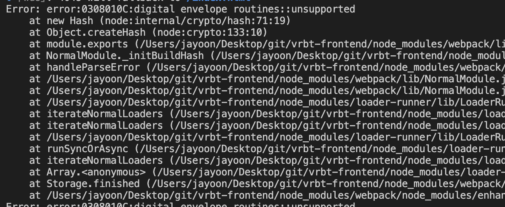

Gatsby로 기술블로그를 만들기 위해 노드 버전을 v16.x에서 v18.x로 올렸더니 기존 프로젝트의 빌드가 되지 않는 문제가 발생했습니다.



첫 번째로 `node_modules`를 삭제하고 `npm install`을 다시 해보았으나 결과는 똑같았습니다.

구글링을 해보니 아주 간단하게 해결 방법을 찾을 수 있었습니다.

```shell
export NODE_OPTIONS=--openssl-legacy-provider
```

터미널에 이렇게 명령어를 입력해 주고 다시 npm run start를 하니 정상적으로 작동되었습니다.
