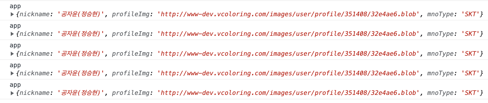
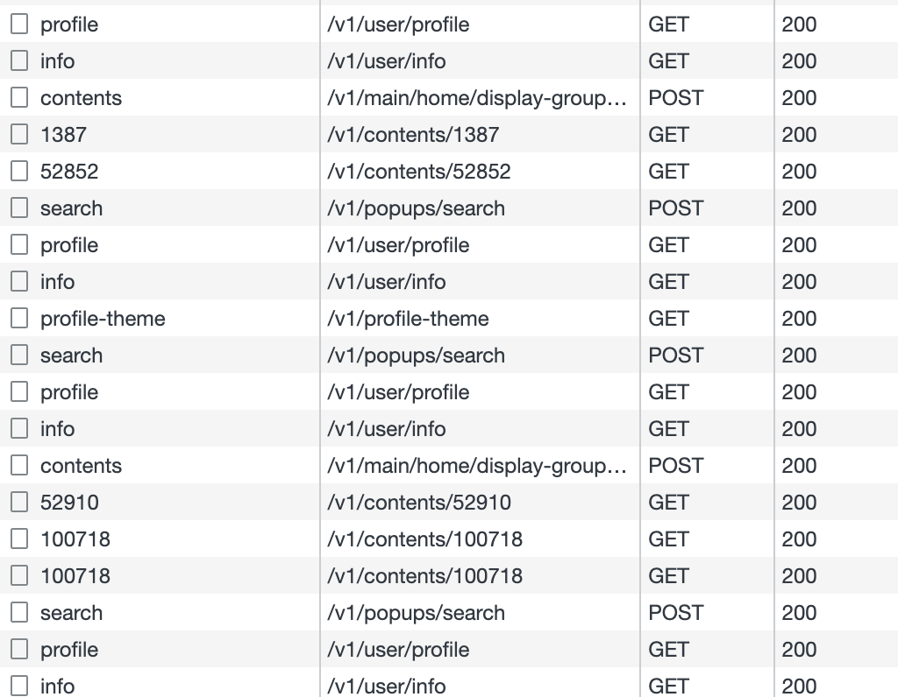
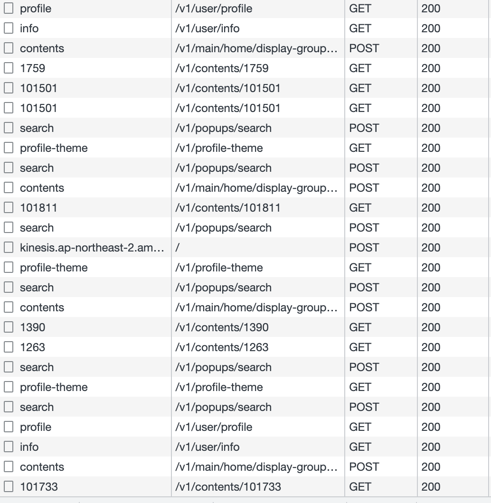

[이전 포스트](https://jayoon-kong.github.io/swr-react_query/)에서도 언급했듯이 현재 V 컬러링의 API는 조회성임에도 불구하고 POST 메소드가 대부분입니다. 가볍게 도입할 수 있는 SWR도 매력적이지만 React Query를 도입하기로 결정한 가장 큰 이유입니다. 그리고 리서치를 하다 보니 React Query가 아무래도 인기도 많고 reference도 많아 실제로 적용하기에도 좋을 것 같았습니다.

우선 어떤 부분에 React Query를 적용할지에 대한 고민을 가장 먼저 시작했습니다. 캐싱 처리와 자동 갱신, 그리고 기존 코드 대비 가장 두드러진 차이를 느낄 수 있는 부분이 뭘까 고민해 보니 단연 User 정보가 제일 먼저 떠오르더군요. 사실 배포 후 사용자가 새로고침을 하지 않으면 캐시 문제 때문에 간혹 브라우저에서 예전 코드를 인식하는 경우가 종종 있었는데, V 컬러링은 작년 하반기 ID 회원체계 개편을 통해 사용자 정보를 가져오는 API 중 상당수가 v2 버전으로 변경된 바 있습니다. 그래서 위와 같은 일이 발생하면 회원가입이 제대로 되지 않거나 혹은 사용자 정보를 제대로 가져오지 못하는 등의 문제가 생기게 되었습니다. V 컬러링 같은 경우 앱을 통해 가입하는 사용자도 많고 (앱은 로그인 처리가 다름) 사용자가 사실 아주 많은 케이스는 아니지만, 그래도 모두가 이용할 수 있는 대국민 서비스인 만큼 꼭 해결해야만 하는 심각한 문제였죠. React Query를 도입하면 이러한 문제가 해결될 것이라 기대해 봅니다.

먼저 범용적으로 사용되고 있는 Redux를 걷어내기 전에 전체적인 구조를 먼저 살펴보았습니다. 현재 User 정보가 변경되는 구간은 다음과 같습니다.

> 1. 회원가입
> 2. 로그인
> 3. 프로필 변경
> 4. 부가서비스 가입 및 해지
> 5. 회원탈퇴

현재 위의 다섯 가지 경우에 User 정보를 갱신하는 API를 호출하고, 그 직후에 변경된 User 정보를 서버로부터 내려받아 Redux Store에 업데이트해 줍니다. 그러면 User 정보를 받아 오는 수많은 화면에서 `dispatch(getUser())`를 통해 자동으로 갱신된 정보를 받아 오게 됩니다. 본 포스트에서는 1차 목표로 사용자 정보의 갱신과 조회를 하는 프로세스에 React Query를 도입하고, 그 과정 및 결과와 트러블 슈팅 등을 기록할 예정입니다.

```javascript
const queryClient = new QueryClient()

ReactDOM.render(
  <QueryClientProvider client={queryClient}>
    <Provider store={store}>
      <BrowserRouter>
        <ToastManager bind={ToastHelper.bind} />
        <PopupManager bind={PopupHelper.bind} />
        <App />
      </BrowserRouter>
    </Provider>
  </QueryClientProvider>,
  rootElement
)
```

기존에 Provider로 감싸져 있던 메인 컴포넌트 위에 QueryClientProvider을 최상위 컴포넌트로 감싸고 QueryClient 값을 Prop으로 넣었습니다.

```javascript
const useUser = () => {
  const result = useQuery("getUser", async () => {
    const [res1, res2] = await Promise.all([
      UserApi.getUser(),
      UserApi.getUserInfo(),
    ])
    if (
      res1.code === StatusCodes.SUCCESS &&
      res2.code === StatusCodes.SUCCESS
    ) {
      return {
        user: res1.data,
        userInfo: res2.data,
      }
    }
    return null
  })
  return result
}
```

다음은 간단하게 useUser라는 hook을 만들었습니다. 첫 번째 인자로는 user 정보를 가져온다는 의미의 getUser을 key로 사용했고, 두 번째 인자(fetcher)는 실제로 사용자 정보를 받아 오는 promise 함수를 사용했습니다.

다음으로는 App.tsx 컴포넌트에서 간단히 user 정보를 가져와 보았습니다.

```javascript
const { data } = useUser()
console.log("app", data?.user)
```



화면을 전환할 때마다 이렇게 데이터가 잘 찍히네요. 근데 좀 이상합니다. 제가 기대한 것은 캐시 처리라 원래 이렇게 API가 자주 호출되면 안될 것 같은데 네트워크 탭을 확인해 보면 주기적으로 API가 호출되고 있네요. 이 부분은 어떤 옵션으로 해결할 수 있을지 좀 더 찾아보도록 하겠습니다.



( v1/user/info와 v1/user/profile이 화면이 전환될 때마다 찍히고 있음을 확인할 수 있습니다.)

### React Query에서의 cache 처리

React Query에서 캐시 처리의 원리를 알기 위해서는 staleTime과 cacheTime의 차이를 알아야 합니다. 그 전에 우선 라이프 사이클에 대한 이해가 필요한데요, A 쿼리 인스턴스가 mount되면 데이터가 fetch되고 useQuery의 첫 번째 인자로 넘긴 query key로 캐싱을 합니다. 이 데이터는 fresh 상태에서 staleTime(기본값 0) 이후에 stale 상태로 변경되고, A 쿼리 인스턴스가 unmount되는 시점부터 캐시는 cacheTime(기본값 5)만큼 유지되다가 가비지 콜렉터로 넘겨집니다. 만일 cacheTime이 지나기 전에 A 쿼리 인스턴스가 새롭게 mount되면, fetch가 실행되고 fresh한 값을 가져오는 동안 캐시된 데이터를 보여주게 됩니다.

그럼 이제 staleTime과 cacheTime의 차이점을 알아보겠습니다.

- **staleTime**
  - 데이터가 fresh 상태에서 stale 상태로 변경되는 데 걸리는 시간
  - fresh 상태일 때는 쿼리 인스턴스가 새롭게 mount되어도 fetch가 일어나지 않는다.
  - 데이터가 한 번 fetch되고 나서 staleTime이 지나지 않았다면 unmount 후 mount되어도 fetch가 일어나지 않는다.
- **cacheTime**
  - 데이터가 inactive 상태일 때 캐싱된 상태로 남아있는 시간
  - 쿼리 인스턴스가 unmount되면 inactive 상태로 변경되며, 캐시는 cacheTime만큼 유지된다.
  - cacheTime이 지나면 가비지 콜렉터로 수집되며, cacheTime이 지나기 전에 쿼리 인스턴스가 다시 mount되면 데이터를 fetch하는 동안 캐시 데이터를 보여준다.

즉 위의 경우 data fetch가 일어나는 이유는 새로운 쿼리 인스턴스가 Mount되었기 때문(페이지 이동이 일어남)이라고 볼 수 있는데요, 기본적으로 React Query에 아무 설정을 하지 않으면 캐싱이 되지 않는 것이 정상이기 때문에 위와 같은 현상이 일어나게 된 것입니다. 사실 V 컬러링에서는 모든 페이지 이동 시 로그인 여부 및 정회원/준회원 여부를 체크해야 하기 때문에 매번 최신 데이터로 fetch되어야 하는 것이 맞습니다.

하지만 데이터의 fetch가 매번 필요하지 않은 상황이거나, 혹은 이렇게 자주 fetch하지 않고 특정 시간이 지난 이후에만 주기적으로 데이터를 갱신하고 싶다면 어떻게 해야 할까요? 이 때 위에서 살펴본 staleTime과 caheTime의 사용이 필요합니다. 이 두 값은 option으로 처리할 수 있습니다.

```javascript
const useUser = () => {
  const result = useQuery(
    "getUser",
    async () => {
      const [res1, res2] = await Promise.all([
        UserApi.getUser(),
        UserApi.getUserInfo(),
      ])
      if (
        res1.code === StatusCodes.SUCCESS &&
        res2.code === StatusCodes.SUCCESS
      ) {
        return {
          user: res1.data,
          userInfo: res2.data,
        }
      }
      return null
    },
    {
      staleTime: 5000,
      cacheTime: Infinity,
    }
  )
  return result
}
```

User 정보를 받아 오는 쿼리에 위와 같이 옵션을 추가하였습니다. 이렇게 하면 staleTime으로 설정한 시간만큼 데이터의 신선도가 유지되고 (fresh 상태), 이 시간이 지나면 fresh한 상태에서 stale한 상태가 되기 때문에 다시 fetch가 일어나게 됩니다.



현재 위의 App.tsx와 마찬가지로 Player.tsx와 My.tsx에도 화면 진입 시 useUser를 통해 user 정보를 가져오도록 구현해 둔 상태입니다. 캐시 테스트를 하기 위해 5초 동안 player 탭과 my 탭을 여러 번 왔다갔다 했는데요, 위 네트워크 탭에서 볼 수 있듯이 v1/user/info와 v1/user/profile이 화면이 전환될 때마다 찍히는 것이 아니라 간헐적으로 (위에는 표시되지 않습니다만 5초에 한 번씩!) 찍히는 것을 확인할 수 있습니다. staleTime이 5초이기 때문에 한 번 fetch해 온 user 정보가 5초 동안 fresh한 상태로 유지되어 다음 호출 시에는 캐싱된 데이터를 가져오고, 5초가 지나면 stale한 상태로 변경되기 때문에 다시 fetch를 해오게 되는 것이죠. (위 예시는 테스트를 위한 것이고, 실제로 V 컬러링에서는 staleTime을 30분으로 지정하였습니다.)

### refetchInterval, refetchOnWindowFocus, refetchOnReconnect

앞 포스팅에서 언급한 바와 같이 React Query에서는 브라우저에 다시 포커스가 된 경우나 네트워크가 재연결되었을 때 data를 자동 갱신하는 기능을 제공합니다. refetchOnWindowFocus와 refetchOnReconnect를 이용하여 해당 기능을 on/off할 수 있습니다. 사용법은 아주 간단합니다.

```javascript
const useUser = () => {
  const result = useQuery(
    "getUser",
    async () => {
      const [res1, res2] = await Promise.all([
        UserApi.getUser(),
        UserApi.getUserInfo(),
      ])
      if (
        res1.code === StatusCodes.SUCCESS &&
        res2.code === StatusCodes.SUCCESS
      ) {
        return {
          user: res1.data,
          userInfo: res2.data,
        }
      }
      return null
    },
    {
      staleTime: 5000,
      cacheTime: Infinity,
      refetchOnWindowFocus: true,
      refetchOnReconnect: true,
    }
  )
  return result
}
```

이 두 값의 기본값은 true이므로 사실 기능을 사용하고자 할 때에는 굳이 옵션으로 넣지 않아도 됩니다. 기능을 사용하고 싶지 않은 경우에는 false 값을 넣어 주면 해당 기능을 사용하지 않을 수 있습니다.

그리고 refetchInterval 값을 통해 갱신 타임을 설정할 수도 있습니다. 폴링 구현 시 유용할 것 같습니다.

### useMutation

위와 같이 staleTime으로 반복적인 API 호출을 제어했습니다. 그런데 회원 가입이나 로그인, 탈퇴 등의 이유로 사용자 정보가 즉각적으로 변경되어야 하는 경우에는 어떻게 해야 할까요? 데이터의 상태가 stale이 될 때까지(30분을) 마냥 기다릴 수는 없겠죠. 이런 경우에 useMutation을 사용하여 데이터를 업데이트해 줍니다.

React Query에서 제공하는 useMutation은 손쉽게 데이터를 업데이트해 주는 장점도 있지만, 무려 업데이트 후 위의 useQuery에서 사용했던 get 함수를 자동으로 재실행해주는 장점도 있습니다. 사용법은 아주 간단합니다. unique key로 맵핑된 get 함수를 invalidateQueries에 넣어주기만 하면 됩니다.

```javascript
const { mutate } = useMutation(async () => {
  const res = await UserApi.logout()
  if (res.code === StatusCodes.SUCCESS) {
    if (EnvChecker.isApp()) {
      NativeHelper.send(NativeActionTypes.LOGOUT)
    }
    queryClient.invalidateQueries("getUser")
  }
})
```

위 코드는 로그아웃 예시인데요, 이렇게 구현하기만 하면 로그아웃 시 자동으로 ‘getUser’에 맵핑된 useUser를 실행하면서 user 정보를 갱신합니다.

위 예제에서는 성공했을 경우를 따로 구현했지만, useMutation에서도 함수 실행이 성공했을 경우의 처리 방법을 제공해 줍니다.

```javascript
const { mutate } = useMutation(() => UserApi.logout(), {
  onSuccess: () => {
    if (EnvChecker.isApp()) {
      NativeHelper.send(NativeActionTypes.LOGOUT)
    }
    queryClient.invalidateQueries("getUser")
  },
})
```

조금 더 가독성이 좋아진 것을 느낄 수 있습니다. :)

하지만 여러 곳에서 사용하려니 중복 코드가 되어 버리네요. useUser처럼 공통으로 사용할 수 있도록 따로 hook을 만들어 보았습니다.

```javascript
const queryClient = useQueryClient()

const { mutate } = useMutation(api, {
  onSuccess: (res: IResponse<unknown>) => {
    if (callback) callback(res)
    queryClient.invalidateQueries("getUser")
  },
})

return mutate
```

이렇게 API와 콜백 함수를 인자로 받아 공통 처리를 하였더니 훨씬 깔끔하게 쓸 수 있네요.

```javascript
const updateUser = useUpdateUser(() => UserApi.logout(), afterLogout)
```

호출하는 곳에서는 위와 같이 컴포넌트 최상위에 선언을 해 주고 적절한 시점에 updateUser()을 불러 주면 됩니다.

### trouble shooting

React Query를 적용하면서 아무 생각 없이 useMutation을 useEffect와 이벤트 핸들러 호출 부분에 넣어 구현하였더니 자주 볼 수 있는 invalid hook call 에러가 발생하였습니다. 여느 hook과 마찬가지로 함수형 component의 최상위 부분에서 호출을 해야 하는데 제가 그 부분을 간과했던 것이죠. 그래서 위 코드와 같이 선언을 하고, useEffect 내부나 이벤트 핸들러 내부에서 `updateUser()` 을 호출하는 방식으로 변경하였더니 에러가 해결되었습니다.

- 추가 이슈

V 컬러링은 Native 앱에서 My 등 몇 가지 페이지가 웹뷰로 구현되어 있습니다. Redux를 걷어내고 React Query를 적용하는 동안 웹에서는 이슈가 없었으나, 앱 테스트를 해 보니 웹뷰로 되어 있는 부분이 호출될 경우 user 정보를 받아 오지 못해 로그인 페이지가 로딩되는 오류가 발생했습니다.

원인을 파악해 보니 웹뷰가 호출될 때 앱의 토큰 정보를 실어 오고 그 토큰 정보를 바탕으로 user 정보를 갱신하고 있었는데요, 이 부분을 누락하여 user 정보를 제대로 받아오지 못하는 것이었습니다.

그래서 앱 실행 시 최초에 토큰을 받아 온 후, `prefetchQuery`로 먼저 user 정보를 받아오도록 하였습니다.

```javascript
if (Token.getToken()) {
  queryClient.prefetchQuery("getUser", async () => {
    const [res1, res2] = await Promise.all([
      UserApi.getUser(),
      UserApi.getUserInfo(),
    ])
    if (
      res1.code === StatusCodes.SUCCESS &&
      res2.code === StatusCodes.SUCCESS
    ) {
      return {
        user: res1.data,
        userInfo: res2.data,
      }
    }
    return null
  })
}
```

그런데 이렇게 해도 새로고침을 하면 간헐적으로 My 페이지 진입 시 user 정보를 가져오지 못하는 문제가 발생했습니다. 엄청난 삽질 끝에 (거의 10시간... 날아간 불금 ㅠㅠ) prefetchQuery를 하는 부분을 동기 처리하였더니 마침내 이슈가 해결되었습니다! 😊

```javascript
if (Token.getToken()) {
  await queryClient.prefetchQuery("getUser", async () => {
    const [res1, res2] = await Promise.all([
      UserApi.getUser(),
      UserApi.getUserInfo(),
    ])
    if (
      res1.code === StatusCodes.SUCCESS &&
      res2.code === StatusCodes.SUCCESS
    ) {
      return {
        user: res1.data,
        userInfo: res2.data,
      }
    }
    return null
  })
}
```

(바로 await 한 줄로 깔끔하게 해결하였습니다.)

토큰을 가져오는 부분부터 `prefetchQuery`로 데이터를 초기화하고, 마지막에 렌더링을 하는 것까지 모두 await 처리를 하였습니다.

```javascript
try {
  await tryingGetAuth(queryClient)
} finally {
  if (EnvChecker.isDev()) {
    ToastHelper.open(`version: ${VERSION}`)
  }

  // render
  await ReactDOM.render(
    <QueryClientProvider client={queryClient}>
      <BrowserRouter>
        <App />
      </BrowserRouter>
    </QueryClientProvider>,
    rootElement
  )
}
```

### 마무리

지금까지 아주 간단하게(?) React Query를 이용하여 사용자 정보를 가져오고, 업데이트하는 로직을 구현해 보았습니다. 아직까지는 모든 부분에서 에러 없이 잘 동작하고 로그인 유지도 잘 되고 있네요. 추후에는 다른 API에도 React Query를 적용해 보도록 하겠습니다.
